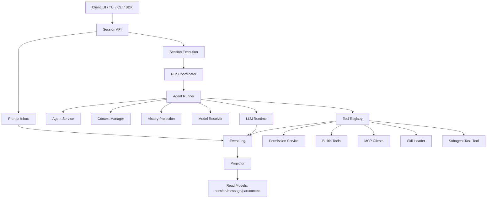

# opencode Agent 架构复刻指南（独立设计版）

本文把 opencode 的 agent runtime 抽象成一套可以独立实现的工程规格。文档尽量不依赖源码路径，而是用模块职责、核心数据模型、函数签名、调用链路、状态机和伪代码描述系统。目标是：读完后可以从零写出一个具备会话持久化、工具循环、权限确认、上下文管理、MCP、Skill、多 Agent、附件/多模态输入能力的 coding agent。

## 1. 目标架构

一个完整 coding agent runtime 可以拆成这些模块：



核心设计原则：

- 用户输入先持久化，再调度模型执行。
- 模型执行和 prompt admission 解耦，避免请求丢失和重试混乱。
- 同一个 Session 同一时刻只有一个 runner drain，不同 Session 可以并发。
- 每个 provider turn 只发起一次模型流请求。
- 工具调用必须先记录，再执行副作用。
- 本地工具全部 settle 后，重新读取投影历史，再决定是否进入下一轮模型调用。
- 系统上下文要可快照、可比较、可替换，不能每轮随意拼字符串。
- MCP、Skill、插件工具、子代理都进入同一套工具、权限、事件和历史体系。
- 多模态附件统一建模为 file part，由 provider adapter 根据模型能力转换。

## 2. 概念词汇

### Session

Session 是一次长期对话或任务活动。它包含：

- 当前工作目录和 workspace 身份。
- 当前 agent 和 model。
- 父子关系，子代理也是独立 Session。
- 会话权限覆盖。
- 标题、摘要、成本、token 统计。
- 已投影的消息历史。

### Prompt

Prompt 是用户输入的 durable 表示，不只是文本，还包括：

- `text`：用户可见文本。
- `files`：文件、图片、PDF、MCP resource 等附件。
- `agents`：用户显式引用的 agent。
- `references`：项目引用、外部引用或无效引用。

### Provider Turn

一次 provider turn 指 runner 构造一份完整模型请求，然后调用一次 `llm.stream(request)`。模型可能在这一轮中输出文本、reasoning、工具调用或错误。

### Tool Settlement

工具调用的完整生命周期：

```text
模型产生 tool-call
  -> 记录 tool called 事件
  -> 权限检查
  -> 执行工具副作用
  -> 约束输出大小
  -> 记录 tool success / failed
  -> 下一轮模型调用读取工具结果
```

### Context Epoch

上下文 epoch 是某个 Session 在某个 agent 下的一代系统上下文。它包含：

- 完整 baseline system prompt。
- 每个上下文源的结构化快照。
- baseline 对应的事件序列位置。
- revision，用于并发控制。

## 3. 数据模型

下面是可直接实现的最小关系模型。可以用 SQLite、Postgres 或任何支持事务和唯一索引的存储。

### Session 表

```ts
type SessionRow = {
  id: SessionID
  projectID: string
  workspaceID?: string
  parentID?: SessionID
  directory: string
  path?: string
  title: string
  version: string

  agent?: AgentID
  model?: ModelRef
  permission?: PermissionRule[]

  cost: number
  tokensInput: number
  tokensOutput: number
  tokensReasoning: number
  tokensCacheRead: number
  tokensCacheWrite: number

  timeCreated: number
  timeUpdated: number
  timeArchived?: number
  timeCompacting?: number
}
```

### Event Log

事件日志是 durable runtime 的核心。每条事件属于一个 aggregate，Session 事件的 aggregate 就是 `sessionID`。

```ts
type EventRow = {
  id: EventID
  aggregateID: string
  seq: number
  type: string
  data: unknown
  timeCreated: number
}
```

约束：

- `(aggregateID, seq)` 唯一。
- 同一个 aggregate 内 seq 严格递增。
- 发布事件和 projector 更新最好在同一个事务或同一提交协议里完成。

### Prompt Inbox

Prompt inbox 保存“已经接收但尚未提升为可见用户消息”的输入。

```ts
type SessionInputRow = {
  id: MessageID
  sessionID: SessionID
  prompt: Prompt
  delivery: "steer" | "queue"
  admittedSeq: number
  promotedSeq?: number
  timeCreated: number
}
```

语义：

- `steer`：默认用户输入。当前活动下一次安全边界吸收。
- `queue`：排队输入。当前活动结束后 FIFO 打开未来活动。
- 复用 `id` 时，只有 `sessionID + prompt + delivery` 完全一致才算幂等重试。
- 如果同一个 `id` 对应不同 prompt 或不同 delivery，必须报冲突。

### Projected Message

Runner 不直接消费事件日志，而是消费投影后的 message。

```ts
type SessionMessage =
  | UserMessage
  | AssistantMessage
  | SyntheticMessage
  | ContextUpdateMessage
  | CompactionMessage

type UserMessage = {
  id: MessageID
  sessionID: SessionID
  seq: number
  type: "user"
  text: string
  files?: FileAttachment[]
  agents?: AgentAttachment[]
  references?: ReferenceAttachment[]
  timeCreated: number
}

type AssistantMessage = {
  id: MessageID
  sessionID: SessionID
  seq: number
  type: "assistant"
  agent: AgentID
  model: ModelRef
  content: AssistantContent[]
  tokens?: TokenUsage
  cost?: number
  finish?: string
  error?: RuntimeError
  timeCreated: number
}
```

Assistant content：

```ts
type AssistantContent =
  | { type: "text"; id: string; text: string }
  | { type: "reasoning"; id: string; text: string; providerMetadata?: unknown }
  | {
      type: "tool"
      id: ToolCallID
      name: string
      input: Record<string, unknown>
      providerExecuted: boolean
      state:
        | { status: "pending"; raw?: string }
        | { status: "running"; input: Record<string, unknown>; title?: string; metadata?: unknown }
        | {
            status: "completed"
            input: Record<string, unknown>
            output: string
            attachments?: FileAttachment[]
            metadata?: unknown
            outputPaths?: string[]
          }
        | { status: "error"; input?: Record<string, unknown>; error: string }
    }
```

### File Attachment

所有多模态、文件、MCP blob、工具附件都统一走 file attachment。

```ts
type FileAttachment = {
  uri: string
  mime: string
  name?: string
  description?: string
  source?: SourceRange
}

type SourceRange = {
  text: string
  start: number
  end: number
}
```

`uri` 支持：

- `file://...`：workspace 或本地文件引用。
- `data:<mime>;base64,...`：上传内容或工具生成内容。
- `mcp://...` 或自定义 URI：MCP resource 或引用。

### Context Epoch

```ts
type ContextEpochRow = {
  sessionID: SessionID
  agent: AgentID
  baseline: string
  snapshot: Record<SystemContextKey, SourceSnapshot>
  baselineSeq: number
  replacementSeq?: number
  revision: number
}

type SourceSnapshot = {
  value: Json
  removed?: string
}
```

## 4. 事件模型

建议实现这些 durable 事件。

### Prompt 生命周期

```ts
type PromptAdmitted = {
  type: "session.prompt.admitted"
  sessionID: SessionID
  messageID: MessageID
  prompt: Prompt
  delivery: "steer" | "queue"
  timestamp: number
}

type PromptPromoted = {
  type: "session.prompt.promoted"
  sessionID: SessionID
  messageID: MessageID
  prompt: Prompt
  timeCreated: number
  timestamp: number
}
```

### Assistant Step

```ts
type StepStarted = {
  type: "session.step.started"
  sessionID: SessionID
  assistantMessageID: MessageID
  agent: AgentID
  model: ModelRef
  snapshot?: string
  timestamp: number
}

type StepEnded = {
  type: "session.step.ended"
  sessionID: SessionID
  assistantMessageID: MessageID
  finish: string
  cost: number
  tokens: TokenUsage
  snapshot?: string
  timestamp: number
}

type StepFailed = {
  type: "session.step.failed"
  sessionID: SessionID
  assistantMessageID: MessageID
  error: RuntimeError
  timestamp: number
}
```

### Text 与 Reasoning

Delta 可以只发给 live UI，不一定持久化。可重放边界必须有完整值。

```ts
type TextStarted = { type: "session.text.started"; sessionID: SessionID; assistantMessageID: MessageID; textID: string }
type TextDelta = { type: "session.text.delta"; sessionID: SessionID; assistantMessageID: MessageID; textID: string; delta: string }
type TextEnded = { type: "session.text.ended"; sessionID: SessionID; assistantMessageID: MessageID; textID: string; text: string }

type ReasoningStarted = { type: "session.reasoning.started"; sessionID: SessionID; assistantMessageID: MessageID; reasoningID: string }
type ReasoningDelta = { type: "session.reasoning.delta"; sessionID: SessionID; assistantMessageID: MessageID; reasoningID: string; delta: string }
type ReasoningEnded = { type: "session.reasoning.ended"; sessionID: SessionID; assistantMessageID: MessageID; reasoningID: string; text: string }
```

### Tool

```ts
type ToolInputStarted = {
  type: "session.tool.input.started"
  sessionID: SessionID
  assistantMessageID: MessageID
  callID: ToolCallID
  name: string
}

type ToolInputEnded = {
  type: "session.tool.input.ended"
  sessionID: SessionID
  assistantMessageID: MessageID
  callID: ToolCallID
  text: string
}

type ToolCalled = {
  type: "session.tool.called"
  sessionID: SessionID
  assistantMessageID: MessageID
  callID: ToolCallID
  tool: string
  input: Record<string, unknown>
  provider: { executed: boolean; metadata?: unknown }
}

type ToolSuccess = {
  type: "session.tool.success"
  sessionID: SessionID
  assistantMessageID: MessageID
  callID: ToolCallID
  structured: Record<string, unknown>
  content: ToolContent[]
  outputPaths?: string[]
  result?: unknown
  provider: { executed: boolean; metadata?: unknown }
}

type ToolFailed = {
  type: "session.tool.failed"
  sessionID: SessionID
  assistantMessageID: MessageID
  callID: ToolCallID
  error: RuntimeError
  result?: unknown
  provider: { executed: boolean; metadata?: unknown }
}
```

### 其他事件

```ts
type ContextUpdated = {
  type: "session.context.updated"
  sessionID: SessionID
  messageID: MessageID
  text: string
  timestamp: number
}

type InterruptRequested = {
  type: "session.interrupt.requested"
  sessionID: SessionID
  timestamp: number
}

type CompactionEnded = {
  type: "session.compaction.ended"
  sessionID: SessionID
  messageID: MessageID
  reason: "auto" | "manual"
  text: string
  recent: string
  timestamp: number
}
```

## 5. Session API

### 接口签名

```ts
interface SessionService {
  create(input: {
    id?: SessionID
    location: LocationRef
    agent?: AgentID
    model?: ModelRef
  }): Promise<SessionInfo>

  get(sessionID: SessionID): Promise<SessionInfo>

  messages(input: {
    sessionID: SessionID
    limit?: number
    order?: "asc" | "desc"
    cursor?: { id: MessageID; direction: "previous" | "next" }
  }): Promise<SessionMessage[]>

  context(sessionID: SessionID): Promise<SessionMessage[]>

  events(input: {
    sessionID: SessionID
    after?: EventCursor
  }): AsyncIterable<SessionEvent>

  prompt(input: {
    id?: MessageID
    sessionID: SessionID
    prompt: Prompt
    delivery?: "steer" | "queue"
    resume?: boolean
  }): Promise<AdmittedPrompt>

  resume(sessionID: SessionID): Promise<void>
  interrupt(sessionID: SessionID): Promise<void>
  wait(sessionID: SessionID): Promise<void>
}
```

### `prompt(...)` 的职责

`prompt(...)` 只做三件事：

1. 校验 Session 存在。
2. 把 prompt 记录到 durable inbox。
3. 如果 `resume !== false`，异步 wake 当前 Session。

伪代码：

```ts
async function prompt(input) {
  await requireSession(input.sessionID)

  const admitted = await sessionInput.admit({
    id: input.id ?? createMessageID(),
    sessionID: input.sessionID,
    prompt: input.prompt,
    delivery: input.delivery ?? "steer",
  })

  if (input.resume !== false) {
    execution.wake(admitted.sessionID, admitted.admittedSeq).catch(log)
  }

  return admitted
}
```

注意：这里不要直接调用模型。这样才能支持崩溃恢复、幂等重试、queue/steer 合并和外部显式 resume。

## 6. Prompt Admission 与 Promotion

### Admission

```ts
interface SessionInputStore {
  admit(input: {
    id: MessageID
    sessionID: SessionID
    prompt: Prompt
    delivery: "steer" | "queue"
  }): Promise<AdmittedPrompt>

  hasPending(sessionID: SessionID, delivery: "steer" | "queue"): Promise<boolean>
  promoteSteers(sessionID: SessionID, cutoffSeq: number): Promise<void>
  promoteNextQueued(sessionID: SessionID): Promise<void>
  latestSeq(sessionID: SessionID): Promise<number>
}
```

Admission 规则：

- 如果 inbox 已经存在相同 `id`，读取它。
- 如果内容等价，返回旧记录，表示幂等。
- 如果不等价，抛 `PromptConflictError`。
- 新 admission 必须发布 `PromptAdmitted` 事件。

### Promotion

Promotion 把 pending input 变成可见 user message。

`steer` promotion：

- 取 `promotedSeq IS NULL` 且 `delivery = "steer"` 的所有 input。
- 只提升 `admittedSeq <= cutoffSeq` 的输入。
- 每个 input 发布 `PromptPromoted`。

`queue` promotion：

- 取最早一个 pending queue input。
- 发布 `PromptPromoted`。
- 然后吸收在 cutoff 前到达的 steer input。

为什么需要 cutoff：

- runner 准备某轮时要有稳定边界。
- 边界之后进来的 steer 不能插到已经准备好的 provider request 中。
- 这些新 steer 会在下一次安全边界进入。

## 7. Run Coordinator

Coordinator 负责同 Session 串行化执行。

### 接口签名

```ts
interface RunCoordinator<Key, A, E> {
  run(key: Key): Promise<A>
  wake(key: Key, seq?: number): Promise<void>
  interrupt(key: Key, seq?: number): Promise<void>
  awaitIdle(key: Key): Promise<void>
}
```

### 状态机

```text
idle
  -- run/wake -->
draining
  -- run/wake while draining -->
draining + pending follow-up
  -- current success and pending exists -->
draining next generation
  -- no pending -->
idle
```

规则：

- `run` 是显式请求，调用方等待结果。
- `wake` 是 advisory，表示 durable work 可能可用；重复 wake 合并。
- 如果当前正在 `wake` drain，新的 `run` 会升级 pending demand。
- `interrupt` 中断当前 owner fiber/task。
- 中断 seq 之前的旧 wake 要抑制，避免用户中断后旧工作又自动继续。
- drain 粒度是 Session ID，不是全局锁。

## 8. Agent Runner

Agent Runner 是核心工具调用循环。它从 durable 状态恢复，构造 provider request，处理流事件，执行工具，再决定是否继续。

### 接口签名

```ts
interface SessionRunner {
  run(input: {
    sessionID: SessionID
    force?: boolean
  }): Promise<void>
}
```

### Runner 外层循环

```ts
const MAX_STEPS = 25

async function run({ sessionID, force }) {
  await failInterruptedTools(sessionID)

  let promotion = await initialPromotion(sessionID, force)
  let needsContinuation = true

  for (let step = 0; step < MAX_STEPS; step++) {
    needsContinuation = await runTurn(sessionID, promotion)
    promotion = undefined

    if (needsContinuation) continue

    if (await inputStore.hasPending(sessionID, "steer")) {
      promotion = "steer"
      needsContinuation = true
      continue
    }

    break
  }

  if (needsContinuation) {
    throw new StepLimitExceededError(sessionID, MAX_STEPS)
  }

  if (await inputStore.hasPending(sessionID, "queue")) {
    await run({ sessionID, force: true })
  }
}
```

### 单轮 provider turn

```ts
async function runTurn(sessionID, promotion) {
  const session = await store.get(sessionID)
  assertSessionStillInThisLocation(session)

  const agent = await agents.select(session.agent)

  if (promotion === "steer") {
    await inputStore.promoteSteers(sessionID, await inputStore.latestSeq(sessionID))
  }

  if (promotion === "queue") {
    const cutoff = await inputStore.latestSeq(sessionID)
    await inputStore.promoteNextQueued(sessionID)
    await inputStore.promoteSteers(sessionID, cutoff)
  }

  const system = await contextEpoch.prepare(sessionID, agent)
  const current = await store.get(sessionID)
  assertAgentAndModelDidNotChange(session, current, agent)

  const model = await modelResolver.resolve(current)
  const history = await historyStore.entriesForRunner(sessionID, system.baselineSeq)
  const tools = await toolRegistry.materialize(agent.permissions)

  const request = buildLLMRequest({
    model,
    system: [agent.system, system.baseline],
    messages: toLLMMessages(history, model),
    tools: tools.definitions,
  })

  if (await compaction.compactIfNeeded(sessionID, history, model, request)) {
    return true
  }

  return await streamOneProviderTurn(sessionID, agent, model, request, tools)
}
```

### 流式处理

```ts
async function streamOneProviderTurn(sessionID, agent, model, request, tools) {
  const toolTasks: Promise<void>[] = []
  let needsContinuation = false
  let providerError = false

  for await (const event of llm.stream(request)) {
    await publishLLMEvent(event)

    if (event.type === "provider-error") {
      providerError = true
      continue
    }

    if (event.type !== "tool-call") continue
    if (event.providerExecuted) continue

    needsContinuation = true

    const assistantMessageID = await assistantMessageIDFor(event)

    await publishToolCalledBeforeSideEffect({
      sessionID,
      assistantMessageID,
      call: event.call,
    })

    toolTasks.push(
      settleToolCall({
        sessionID,
        agent,
        assistantMessageID,
        call: event.call,
        tools,
      }),
    )
  }

  await Promise.allSettled(toolTasks)

  return !providerError && needsContinuation
}
```

必须保证：

- tool call durable 事件先于工具副作用。
- 工具 task 可以并发执行，但 continuation 前必须全部 settle。
- provider stream 结束后不能用内存拼工具结果，要重新读投影历史。

## 9. LLM Runtime

### Provider-neutral Request

建议定义统一请求：

```ts
type LLMRequest = {
  model: ResolvedModel
  system: SystemPart[]
  messages: LLMMessage[]
  tools: ToolDefinition[]
  providerOptions?: Record<string, unknown>
  toolChoice?: "auto" | "required" | "none"
  temperature?: number
  topP?: number
  maxOutputTokens?: number
}
```

### Provider-neutral Events

```ts
type LLMEvent =
  | { type: "text-start"; id: string }
  | { type: "text-delta"; id: string; text: string }
  | { type: "text-end"; id: string; text: string }
  | { type: "reasoning-start"; id: string; metadata?: unknown }
  | { type: "reasoning-delta"; id: string; text: string }
  | { type: "reasoning-end"; id: string; text: string; metadata?: unknown }
  | { type: "tool-input-start"; id: string; name: string }
  | { type: "tool-input-delta"; id: string; delta: string }
  | { type: "tool-input-end"; id: string; text: string }
  | { type: "tool-call"; id: string; name: string; input: Record<string, unknown>; providerExecuted?: boolean }
  | { type: "tool-result"; id: string; result: unknown; providerExecuted: true }
  | { type: "step-end"; finish: string; usage: TokenUsage; cost: number }
  | { type: "provider-error"; error: RuntimeError }
```

### Runtime Adapter

```ts
interface LLMRuntime {
  stream(request: LLMRequest, abort?: AbortSignal): AsyncIterable<LLMEvent>
}
```

Provider adapter 的职责：

- 把统一 message 转换成 provider 原生格式。
- 把 provider stream 转换成统一 `LLMEvent`。
- 做 provider 特定修正，例如工具名规范、reasoning 字段、cache control、headers。
- 不直接写数据库。

事件持久化属于 runner/publisher，不属于 provider adapter。

## 10. 多模态与聊天框附件

多模态实现不要为每种输入单独开分支。统一模型：

```ts
type PromptPartInput =
  | { id?: PartID; type: "text"; text: string; synthetic?: boolean; source?: SourceRange }
  | { id?: PartID; type: "file"; mime: string; url: string; filename?: string; source?: FileSource }
  | { id?: PartID; type: "agent"; name: string; source?: SourceRange }

type FileSource =
  | { type: "file"; path: string; text: SourceRange }
  | { type: "resource"; clientName: string; uri: string; text?: SourceRange }
```

### 聊天框状态

前端 prompt state 可以这样设计：

```ts
type PromptDraftPart =
  | { type: "text"; content: string; start: number; end: number }
  | { type: "file"; path: string; content: string; start: number; end: number; selection?: FileSelection }
  | { type: "agent"; name: string; content: string; start: number; end: number }
  | { type: "attachment"; id: string; filename: string; mime: string; dataUrl: string }
```

这里 `attachment` 可以承载图片、PDF、文本上传。不要被字段名限制成只能是图片。

### 添加附件

附件入口：

- 文件选择器：接受图片、PDF、文本文件。
- 拖拽：拖文件进入输入框时读取为上传附件；拖 `file:<path>` 文本时插入文件引用。
- 粘贴：剪贴板里有 file item 就读取 file；桌面端如浏览器拿不到图片剪贴板，可加 native clipboard adapter；普通文本按文本插入。

MIME 判断：

```ts
async function attachmentMime(file: File): Promise<string | undefined> {
  const type = normalizeMime(file.type)
  if (isAcceptedImage(type)) return type
  if (type === "application/pdf") return type
  if (isTextMime(type)) return "text/plain"

  const byExtension = guessImageOrPdfByExtension(file.name)
  if ((!type || type === "application/octet-stream") && byExtension) return byExtension

  const sample = new Uint8Array(await file.slice(0, 4096).arrayBuffer())
  if (looksLikeText(sample)) return "text/plain"

  return undefined
}
```

读取为 data URL：

```ts
async function attachmentDataUrl(file: File, mime: string): Promise<string> {
  const raw = await readAsDataURL(file)
  const base64 = raw.slice(raw.indexOf(",") + 1)
  return `data:${mime};base64,${base64}`
}
```

### 提交请求

将聊天框状态转成 `PromptPartInput[]`：

```ts
function buildRequestParts(input: {
  draft: PromptDraftPart[]
  contextFiles: ContextFile[]
  sessionDirectory: string
  text: string
}): PromptPartInput[] {
  const parts: PromptPartInput[] = [{ type: "text", text: input.text }]

  for (const file of draftFileMentions(input.draft)) {
    parts.push({
      type: "file",
      mime: "text/plain",
      url: `file://${absolute(input.sessionDirectory, file.path)}${selectionQuery(file.selection)}`,
      filename: basename(file.path),
      source: { type: "file", path: file.path, text: sourceRange(file) },
    })
  }

  for (const context of input.contextFiles) {
    if (context.comment) {
      parts.push({ type: "text", text: formatComment(context), synthetic: true })
    }
    parts.push({
      type: "file",
      mime: "text/plain",
      url: `file://${absolute(input.sessionDirectory, context.path)}${selectionQuery(context.selection)}`,
      filename: basename(context.path),
    })
  }

  for (const attachment of draftAttachments(input.draft)) {
    parts.push({
      type: "file",
      mime: attachment.mime,
      url: attachment.dataUrl,
      filename: attachment.filename,
    })
  }

  return parts
}
```

### 服务端解析附件

服务端按 URI 协议处理：

```ts
async function resolveUserPart(part: PromptPartInput): Promise<MessagePart[]> {
  if (part.type === "text") return [textPart(part.text)]
  if (part.type === "agent") return resolveAgentMention(part)
  if (part.type !== "file") return []

  if (part.source?.type === "resource") {
    return resolveMcpResource(part)
  }

  const url = new URL(part.url)

  if (url.protocol === "data:") {
    if (part.mime === "text/plain") {
      return [
        syntheticText(`Called the Read tool with ${part.filename}`),
        syntheticText(decodeDataUrl(part.url)),
        filePart(part),
      ]
    }
    return [filePart(part)]
  }

  if (url.protocol === "file:") {
    const filepath = fileURLToPath(part.url)
    if (await isDirectory(filepath)) {
      return readDirectoryAsTextTrace(filepath, part)
    }
    if (part.mime === "text/plain") {
      return readTextFileAsTextTrace(filepath, part, selectionFromQuery(url))
    }
    return [await localBinaryFileAsDataUrl(filepath, part.mime, part.filename)]
  }

  return [filePart(part)]
}
```

图片归一化：

```ts
type ImageConfig = {
  autoResize: boolean
  maxWidth: number
  maxHeight: number
  maxBase64Bytes: number
}

interface ImageNormalizer {
  normalize(file: FileMessagePart, config: ImageConfig): Promise<FileMessagePart>
}
```

默认策略：

- 只处理 `mime.startsWith("image/")` 的 data URL。
- 解码图片，读取原始宽高和 base64 大小。
- 如果宽高和大小都在限制内，原样返回。
- 如果开启自动缩放，按比例缩小，再尝试 PNG 和多档 JPEG 质量。
- 如果仍然超过限制，返回错误并让上层提示用户。

### 转成模型消息

用户消息转换：

```ts
function toModelUserContent(part: MessagePart, options: { stripMedia?: boolean }): ModelContent[] {
  if (part.type === "text" && part.text) {
    return [{ type: "text", text: part.text }]
  }

  if (part.type === "file") {
    if (part.mime === "text/plain" || part.mime === "application/x-directory") return []

    if (options.stripMedia && isMedia(part.mime)) {
      return [{ type: "text", text: `[Attached ${part.mime}: ${part.filename ?? "file"}]` }]
    }

    return [{
      type: "file",
      url: part.url,
      mediaType: part.mime,
      filename: part.filename,
    }]
  }

  return []
}
```

Provider capability check：

```ts
function mimeToModality(mime: string): "image" | "audio" | "video" | "pdf" | undefined {
  if (mime.startsWith("image/")) return "image"
  if (mime.startsWith("audio/")) return "audio"
  if (mime.startsWith("video/")) return "video"
  if (mime === "application/pdf") return "pdf"
}

function unsupportedParts(messages: ModelMessage[], model: ResolvedModel): ModelMessage[] {
  return messages.map((message) => {
    if (message.role !== "user") return message
    return {
      ...message,
      content: message.content.map((part) => {
        if (part.type !== "file" && part.type !== "image") return part
        const mime = part.type === "file" ? part.mediaType : mimeFromDataUrl(part.image)
        const modality = mimeToModality(mime)
        if (!modality) return part
        if (model.capabilities.input[modality]) return part
        return {
          type: "text",
          text: `ERROR: Cannot read "${part.filename ?? modality}" (this model does not support ${modality} input). Inform the user.`,
        }
      }),
    }
  })
}
```

Provider adapter 再把统一 file content 转成供应商格式：

- OpenAI Responses：图片转 `input_image`，PDF/文件转 `input_file`。
- Anthropic：转内容数组中的 image/document。
- Google/Gemini：转 inline data 或 file data。
- 不支持的 provider：前一层已经替换成文本错误。

### 工具结果里的媒体

工具也可以返回附件：

```ts
type ToolResult = {
  title: string
  output: string
  metadata?: Record<string, unknown>
  attachments?: FileMessagePart[]
}
```

处理规则：

- 工具结果先保存到 assistant tool state。
- 图片附件也要走 `ImageNormalizer`。
- 下一轮模型消息构造时，如果 provider 支持媒体在 tool result 中出现，就保留在 tool result。
- 如果 provider 不支持媒体在 tool result 中出现，但模型支持该媒体输入，则抽出媒体，追加一条 synthetic user message：

```text
Attached media from tool result:
<file parts...>
```

- 如果历史被 compacted 或 `stripMedia` 开启，则媒体替换成占位文本。

## 11. 工具系统

### Tool 定义

```ts
interface ToolDefinition<Input, Output> {
  description: string
  inputSchema: JsonSchema
  outputSchema: JsonSchema

  execute(input: Input, context: ToolContext): Promise<Output>

  toModelOutput?(input: {
    input: Input
    output: Output
  }): ToolContent[]
}

type ToolContext = {
  sessionID: SessionID
  agent: AgentID
  assistantMessageID: MessageID
  toolCallID: ToolCallID
  abort?: AbortSignal
}
```

### Tool Registry

```ts
interface ToolRegistry {
  register(tools: Record<string, ToolDefinition<any, any>>): Disposable

  materialize(permissions?: PermissionRule[]): Promise<{
    definitions: ModelToolDefinition[]
    settle(input: {
      sessionID: SessionID
      agent: AgentID
      assistantMessageID: MessageID
      call: ToolCall
    }): Promise<ToolSettlement>
  }>
}
```

Materialize 规则：

- 合并内置工具、插件工具、MCP 工具和 scoped runtime 工具。
- 根据 agent permissions 过滤完全 deny 的工具。
- 给本轮工具列表绑定 identity。
- settle 时如果工具 identity 已变化，返回 stale tool call error。

### Tool Settlement

```ts
async function settleToolCall(input) {
  const tool = materializedTools.find(input.call.name)
  if (!tool) return toolError("Unknown tool")

  const decoded = decode(tool.inputSchema, input.call.input)
  await permission.assert({
    sessionID: input.sessionID,
    agent: input.agent,
    action: permissionActionForTool(tool),
    resources: permissionResources(decoded),
    source: { type: "tool", messageID: input.assistantMessageID, callID: input.call.id },
  })

  const output = await tool.execute(decoded, context)
  const encoded = encode(tool.outputSchema, output)
  const bounded = await outputStore.bound(encoded)

  return {
    result: bounded.result,
    output: bounded.output,
    outputPaths: bounded.outputPaths,
  }
}
```

内置工具建议至少包括：

- `read`
- `write`
- `edit`
- `apply_patch`
- `bash`
- `grep`
- `glob`
- `webfetch`
- `websearch`
- `question`
- `todowrite`
- `skill`
- `task`

## 12. 权限系统

### 数据模型

```ts
type PermissionEffect = "allow" | "ask" | "deny"

type PermissionRule = {
  action: string
  resource: string
  effect: PermissionEffect
}

type PermissionRequest = {
  id: PermissionID
  sessionID: SessionID
  action: string
  resources: string[]
  save?: string[]
  metadata?: Record<string, unknown>
  source?: { type: "tool"; messageID: MessageID; callID: ToolCallID }
}

type PermissionReply = "once" | "always" | "reject"
```

### 接口签名

```ts
interface PermissionService {
  evaluate(action: string, resource: string, ...rulesets: PermissionRule[][]): PermissionRule

  ask(input: Omit<PermissionRequest, "id"> & { id?: PermissionID; agent?: AgentID }): Promise<{
    id: PermissionID
    effect: PermissionEffect
  }>

  assert(input: Omit<PermissionRequest, "id"> & { id?: PermissionID; agent?: AgentID }): Promise<void>

  reply(input: {
    requestID: PermissionID
    reply: PermissionReply
    message?: string
  }): Promise<void>

  list(): Promise<PermissionRequest[]>
  forSession(sessionID: SessionID): Promise<PermissionRequest[]>
}
```

### 评估规则

- ruleset 线性合并。
- 使用 wildcard 匹配 `action` 和 `resource`。
- 最后一个匹配规则生效。
- 没有匹配时默认 `ask`。
- 只要某个 resource 被当前 agent rules deny，直接拒绝。
- saved rules 只能把 ask 变 allow，不能覆盖 agent deny。

### assert 流程

```ts
async function assert(input) {
  const rules = await configuredRules(input.sessionID, input.agent)
  const saved = await savedRules(projectOf(input.sessionID))
  const effect = evaluateAll(input.action, input.resources, rules, saved)

  if (effect === "deny") throw new PermissionDeniedError()
  if (effect === "allow") return

  const request = createPermissionRequest(input)
  const deferred = pending.create(request)
  await eventBus.publish({ type: "permission.asked", request })

  await deferred
}
```

Reply 流程：

- `once`：释放当前 deferred。
- `always`：保存 allow 规则，释放当前 deferred，并检查同 Session 其他 pending 请求是否也被新规则允许。
- `reject`：拒绝当前请求，并拒绝同 Session 其他 pending 请求。

## 13. 上下文管理

### System Context Source

上下文源是可独立观察、比较、渲染的一块系统上下文。

```ts
type SystemContextSource<A> = {
  key: string
  codec: Codec<A, Json>
  load(): Promise<A | Unavailable>
  baseline(current: A): string
  update(previous: A, current: A): string
  removed?(previous: A): string
}
```

常见 source：

- 环境：工作目录、日期、平台、shell。
- 指令：全局和项目 instruction 文档。
- Skill guidance：当前 agent 可用 skill 摘要。
- Agent/system：agent 自身 system prompt。
- Workspace state：可选，例如 git 状态或项目元信息。

### 初始化

```ts
async function initialize(context: SystemContext): Promise<{
  baseline: string
  snapshot: Record<string, SourceSnapshot>
}> {
  const entries = await observeAllSources(context)
  if (entries.some((x) => x.unavailable)) throw new ContextInitializationBlocked()

  return {
    baseline: entries.map((x) => x.baselineText).join("\n\n"),
    snapshot: Object.fromEntries(entries.map((x) => [x.key, x.snapshot])),
  }
}
```

### Reconcile

```ts
type ReconcileResult =
  | { tag: "Unchanged" }
  | { tag: "Updated"; text: string; snapshot: Record<string, SourceSnapshot> }
  | { tag: "ReplacementReady"; generation: ContextGeneration }
  | { tag: "ReplacementBlocked" }
```

规则：

- source key 相同且 codec 能解码旧 snapshot，使用 equality 判断是否变更。
- 兼容变更生成 update 文本，并发布 `ContextUpdated`。
- 新增 source 可作为 update 加入。
- 删除 source 如果有 `removed(...)` 文本，可作为 update。
- 如果 codec 不兼容、缺少 removed 文本或 agent 切换，需要 replacement。
- 如果旧 snapshot 中已有 source 当前不可用，replacement blocked，不能静默丢上下文。

### Context Epoch Prepare

```ts
async function prepareContextEpoch(sessionID, location, agent): Promise<{
  baseline: string
  baselineSeq: number
  revision: number
}> {
  const stored = await contextEpochStore.find(sessionID)
  const context = await loadSystemContext(agent)

  if (!stored) {
    const generation = await initialize(context)
    const baselineSeq = await latestSessionSeq(sessionID)
    await insertContextEpoch(sessionID, agent, generation, baselineSeq)
    return { baseline: generation.baseline, baselineSeq, revision: 0 }
  }

  const result = await reconcile(context, stored.snapshot)

  if (result.tag === "Unchanged") {
    return stored
  }

  if (result.tag === "Updated") {
    await publishContextUpdated(sessionID, result.text)
    await advanceSnapshot(sessionID, stored.revision, result.snapshot)
    return { ...stored, revision: stored.revision + 1 }
  }

  if (result.tag === "ReplacementReady") {
    const replacementSeq = stored.replacementSeq ?? await latestSessionSeq(sessionID)
    await replaceBaseline(sessionID, stored.revision, replacementSeq, result.generation)
    return { baseline: result.generation.baseline, baselineSeq: replacementSeq, revision: stored.revision + 1 }
  }

  return stored
}
```

## 14. History Projection

Projector 把事件流变成 runner 可消费的 message history。

### 投影职责

- `PromptAdmitted` 写入 inbox。
- `PromptPromoted` 写入 user message。
- `StepStarted` 创建 assistant message。
- `TextEnded` 写入 assistant text content。
- `ReasoningEnded` 写入 reasoning content。
- `ToolCalled` 写入 tool content，状态 pending/running。
- `ToolSuccess` / `ToolFailed` 更新 tool 状态。
- `ContextUpdated` 创建 synthetic/context message。
- `CompactionEnded` 写入 compaction summary 并标记旧内容 compacted。

### Runner History Selection

```ts
interface HistoryStore {
  entriesForRunner(sessionID: SessionID, baselineSeq: number): Promise<HistoryEntry[]>
}
```

规则：

- 只取当前 context epoch `baselineSeq` 之后的可见消息。
- 已 compacted 的旧工具输出要替换成占位或摘要。
- 媒体附件如果被 strip，要替换成 `[Attached <mime>: <name>]`。

## 15. Agent 模型

### 数据模型

```ts
type AgentInfo = {
  id: AgentID
  description?: string
  mode: "primary" | "subagent" | "all"
  hidden?: boolean
  color?: string
  system?: string
  model?: ModelRef
  steps?: number
  permissions: PermissionRule[]
  request?: {
    temperature?: number
    topP?: number
    maxOutputTokens?: number
    providerOptions?: Record<string, unknown>
  }
}
```

默认 agent：

- `build`：默认主 agent，可按权限执行工具。
- `plan`：主 agent，禁止编辑类工具。
- `general`：通用子代理，适合复杂研究和并行任务。
- `explore`：只读探索型子代理，允许 glob/grep/read/web 搜索，禁止写。
- `compaction`：隐藏 agent，用于上下文压缩。
- `title`：隐藏 agent，用于生成标题。
- `summary`：隐藏 agent，用于会话摘要。

### Agent Service

```ts
interface AgentService {
  select(id?: AgentID): Promise<AgentSelection>
  list(): Promise<AgentInfo[]>
  update(mutator: (editor: AgentEditor) => void): Promise<void>
}

type AgentSelection = {
  id: AgentID
  info: AgentInfo
}
```

Agent permissions 是工具可见性和工具执行权限的第一层边界。Session permission 只能进一步覆盖或收紧，不应该绕过 agent deny。

## 16. Model 与 Provider Capability

### 模型数据模型

```ts
type ResolvedModel = {
  id: string
  providerID: string
  name: string
  api: {
    type: "aisdk" | "native" | "custom"
    package?: string
    id: string
  }
  limit: {
    context: number
    input?: number
    output: number
  }
  capabilities: {
    temperature: boolean
    reasoning: boolean
    attachment: boolean
    toolcall: boolean
    input: {
      text: boolean
      image: boolean
      audio: boolean
      video: boolean
      pdf: boolean
    }
    output: {
      text: boolean
      image: boolean
      audio: boolean
      video: boolean
      pdf: boolean
    }
    interleaved?: boolean | { field: string }
  }
}
```

Provider adapter 要做：

- 参数归一化：temperature、topP、maxOutputTokens。
- provider options key 映射。
- message 格式转换。
- unsupported modality 转文本错误。
- tool schema provider-specific 修正。
- stream event 标准化。

## 17. MCP

### MCP Client Manager

```ts
interface MCPService {
  status(): Promise<Record<string, MCPStatus>>
  connect(name: string): Promise<void>
  disconnect(name: string): Promise<void>
  tools(): Promise<Record<string, RuntimeTool>>
  prompts(): Promise<Record<string, MCPPromptInfo>>
  resources(): Promise<Record<string, MCPResourceInfo>>
  getPrompt(clientName: string, name: string, args?: Record<string, string>): Promise<MCPPrompt | undefined>
  readResource(clientName: string, uri: string): Promise<MCPResourceContent | undefined>
}
```

连接类型：

- stdio process。
- Streamable HTTP。
- SSE。

远程连接可支持 OAuth：

- `startAuth(mcpName)` 返回 authorization URL。
- callback server 接收 code。
- token 加密保存。
- 状态包括 connected、disabled、failed、needs_auth、needs_client_registration。

### MCP Tool 转换

```ts
function mcpToolName(clientName: string, toolName: string) {
  return `${sanitize(clientName)}_${sanitize(toolName)}`
}

function convertMcpTool(def: MCPToolDefinition, client: MCPClient): RuntimeTool {
  return {
    description: def.description ?? "",
    inputSchema: normalizeObjectSchema(def.inputSchema),
    async execute(args, ctx) {
      await ctx.ask({
        action: mcpToolName(def.client, def.name),
        resources: ["*"],
        save: ["*"],
      })

      const result = await client.callTool({ name: def.name, arguments: args })
      return normalizeMcpToolResult(result)
    },
  }
}
```

MCP result 转换：

- text content 合并成工具输出文本。
- image content 转 `data:<mime>;base64,...` file attachment。
- resource text 加入文本。
- resource blob 转 file attachment。
- 输出过大时写入 output store，只把摘要和路径给模型。

MCP 工具必须走同一套权限，不要因为 server 是用户配置的就默认可信。

## 18. Skill

Skill 是按需加载的专业工作流说明，不应每轮全文塞进 system prompt。

### 数据模型

```ts
type SkillInfo = {
  name: string
  description?: string
  location: string
  content: string
  slash?: boolean
}

type SkillSource =
  | { type: "directory"; path: string }
  | { type: "url"; url: string }
  | { type: "embedded"; skill: SkillInfo }
```

### Skill Service

```ts
interface SkillService {
  sources(): Promise<SkillSource[]>
  list(): Promise<SkillInfo[]>
  available(agent: AgentInfo): Promise<SkillInfo[]>
  require(name: string): Promise<SkillInfo>
}
```

发现规则：

- 扫描配置目录中的 skill markdown。
- 扫描全局和项目 skill 目录。
- 拉取 URL source 后扫描。
- 注册内置 skill。
- 同名 skill 后加载者覆盖先加载者。

### Skill Guidance

Skill guidance 是一个 system context source，只暴露摘要：

```text
Skills provide specialized instructions and workflows for specific tasks.
Use the skill tool to load a skill when a task matches its description.

<available_skills>
  <skill>
    <name>...</name>
    <description>...</description>
  </skill>
</available_skills>
```

模型真正需要某个 skill 时，调用：

```ts
type SkillToolInput = { name: string }
type SkillToolOutput = {
  content: string
  files?: string[]
}
```

好处：

- 节省 prompt。
- skill 使用变成可审计工具行为。
- agent permission 可以控制某个 skill 是否可见、可加载。

## 19. 多 Agent 与子代理

### Task Tool

```ts
type TaskToolInput = {
  description: string
  prompt: string
  subagentType: string
  taskID?: SessionID
  command?: string
  background?: boolean
}

type TaskToolOutput = {
  title: string
  metadata: {
    parentSessionID: SessionID
    sessionID: SessionID
    model: ModelRef
    background?: boolean
    jobID?: string
  }
  output: string
}
```

执行流程：

```ts
async function executeTask(input, ctx) {
  await ctx.ask({ action: "task", resources: [input.subagentType], save: ["*"] })

  const subagent = await agents.select(input.subagentType)
  const parent = await sessions.get(ctx.sessionID)
  const childPermission = deriveSubagentPermission(parent, subagent)

  const child =
    input.taskID
      ? await sessions.get(input.taskID)
      : await sessions.create({
          parentID: parent.id,
          title: `${input.description} (@${subagent.id} subagent)`,
          agent: subagent.id,
          permission: childPermission,
          location: parent.location,
        })

  const runChild = () =>
    sessionAPI.prompt({
      sessionID: child.id,
      prompt: Prompt.fromText(input.prompt),
      resume: true,
    })

  if (input.background) {
    const job = backgroundJobs.start(child.id, runChild)
    notifyParentWhenDone(parent.id, child.id, job)
    return runningTaskOutput(child.id, input.description)
  }

  const result = await runChildAndWait(child.id, runChild)
  return completedTaskOutput(child.id, result.finalText)
}
```

### 子代理权限继承

```ts
function deriveSubagentPermission(input: {
  parentSessionPermission: PermissionRule[]
  parentAgent: AgentInfo
  subagent: AgentInfo
  primaryTools?: string[]
}): PermissionRule[] {
  return [
    ...parentAgent.permissions.filter((r) => r.effect === "deny" && r.action === "edit"),
    ...input.parentSessionPermission.filter((r) => r.effect === "deny" || r.action === "external_directory"),
    ...denyUnlessSubagentAllows(input.subagent, "todowrite"),
    ...denyUnlessSubagentAllows(input.subagent, "task"),
    ...denyPrimaryTools(input.primaryTools ?? []),
  ]
}
```

重点：

- 必须继承父 agent 的 edit deny。否则 plan 模式可以通过子代理绕过写文件限制。
- 必须继承父 session 的 deny 和 external directory 规则。
- 子代理默认不能继续开子代理，除非自身允许 `task`。
- 子代理默认不能写 todo，除非自身允许 `todowrite`。

## 20. Plugin 扩展点

插件不应该直接修改全局变量。建议通过 editor/registry 注入能力。

```ts
interface Plugin {
  id: string
  setup(ctx: PluginContext): Promise<void>
}

interface PluginContext {
  agents: AgentEditor
  tools: ToolRegistry
  skills: SkillRegistry
  providers: ProviderRegistry
  commands: CommandRegistry
  hooks: HookRegistry
}
```

常见 hooks：

```ts
type Hooks = {
  "tool.definition": (tool: RuntimeTool) => Promise<RuntimeTool>
  "tool.execute.before": (ctx: ToolHookContext, input: { args: unknown }) => Promise<void>
  "tool.execute.after": (ctx: ToolHookContext, output: ToolResult) => Promise<ToolResult>
  "chat.message": (ctx: ChatContext, message: UserMessageDraft) => Promise<UserMessageDraft>
  "chat.system": (ctx: ChatContext, system: string[]) => Promise<string[]>
}
```

Plugin boot 要有完成信号：

```ts
await pluginBoot.wait()
```

Runner 在读取 agent、skill、provider、tool registry 前，应该确保插件已经 boot 完。

## 21. Compaction

### 触发时机

- 构造 provider request 前估算 token，接近模型 context limit 时触发。
- provider 在 assistant 开始前返回 context overflow 时触发。
- 用户手动 compact 时触发。

### 输入选择

```ts
type CompactionInput = {
  previousSummary?: string
  olderMessages: SessionMessage[]
  recentMessages: SessionMessage[]
}
```

策略：

- 保留最近若干消息原文。
- 旧消息交给 compaction agent 总结。
- 已 compacted 的大工具输出替换成占位。
- 媒体附件在 overflow compaction 中移除，并生成明确提示。

### 输出格式

建议让 compaction agent 输出结构化摘要：

```text
<summary>
- 用户目标
- 已完成修改
- 关键文件/路径
- 工具结果
- 未完成事项
- 约束和偏好
- 如果有：之前的 summary 中仍然有效的信息
</summary>
```

### continuation

Compaction 完成后不要继续沿用旧 request。必须：

1. 写入 compaction event。
2. 更新投影。
3. 重新准备 context/history。
4. 重新构造 provider request。

## 22. 中断与清理

### Interrupt

```ts
async function interrupt(sessionID) {
  const event = await publish({ type: "session.interrupt.requested", sessionID })
  await coordinator.interrupt(sessionID, event.seq)
}
```

Runner 被中断后：

- abort provider request。
- abort 正在执行的工具。
- 将 pending/running tool 标记为 interrupted error。
- 不自动恢复旧 wake。

### Startup Cleanup

每次 runner 开始前执行：

```ts
async function failInterruptedTools(sessionID) {
  const context = await history.context(sessionID)
  for (const assistant of assistantMessages(context)) {
    for (const tool of pendingOrRunningTools(assistant)) {
      await publishToolFailed(tool, "Tool execution interrupted")
    }
  }
}
```

这样可以修复进程崩溃或中断留下的 running tool。

## 23. 从零复刻路线

### 阶段 1：事件日志和投影

先实现：

- Event store。
- Session 表。
- Session input inbox。
- Session message projection。
- Prompt admitted/promoted。
- Step/text/tool 事件投影。

验收标准：

- 写入 prompt 后，即使进程重启也能看到 pending input。
- 重放 event log 可以恢复 messages。

### 阶段 2：Coordinator 和 Runner 空循环

实现：

- per-session coordinator。
- `wake/run/interrupt/awaitIdle`。
- runner 能 promote prompt 并创建 user message。

验收标准：

- 同 Session 并发 prompt 不会启动多个 runner。
- 不同 Session 可以并发。

### 阶段 3：LLM Runtime

实现：

- 一个 provider adapter。
- 标准 LLM event。
- text streaming 到 durable `TextEnded`。
- step ended 记录 usage。

验收标准：

- 用户发文本，模型返回文本，重放后可见完整 assistant message。

### 阶段 4：工具系统

实现：

- Tool definition。
- Tool registry。
- Permission assert。
- read/grep/glob/bash 至少四个工具。
- tool call before side effect。
- tool success/failed。
- continuation。

验收标准：

- 模型调用 read，runner 执行 read，下一轮模型能看到 read 结果。

### 阶段 5：Context Epoch

实现：

- environment source。
- instruction source。
- skill guidance source。
- context epoch 表。
- reconcile/update/replacement。

验收标准：

- instruction 文件变化会生成 context update 或 replacement。
- context source 不可用不会静默丢上下文。

### 阶段 6：附件和多模态

实现：

- 前端 file picker / drag / paste。
- data URL 上传。
- `file://` workspace 引用。
- 图片归一化。
- model capability check。
- provider file part 转换。

验收标准：

- 支持图片模型能读取图片。
- 不支持图片模型会得到清晰错误文本。
- PDF 同理按 `pdf` modality 判断。

### 阶段 7：MCP

实现：

- stdio MCP connect。
- listTools。
- callTool。
- MCP content 转文本/附件。
- 工具权限。

验收标准：

- MCP 工具出现在工具列表。
- 模型调用 MCP 工具后能看到结果。

### 阶段 8：Skill

实现：

- skill discovery。
- skill guidance。
- skill tool。
- agent permission filter。

验收标准：

- 可用 skill 摘要进入 system。
- 模型调用 skill 工具后获得全文。

### 阶段 9：Subagent

实现：

- task tool。
- child session。
- 权限继承。
- foreground wait。
- background job。
- parent synthetic result injection。

验收标准：

- 主 agent 能创建 explore/general 子代理。
- plan 模式不能通过子代理写文件。

### 阶段 10：Compaction 和恢复

实现：

- token estimate。
- compaction agent。
- overflow recovery。
- media strip 占位。
- crash startup cleanup。

验收标准：

- 长对话能自动压缩并继续。
- 大媒体导致 overflow 后不会无限失败。

## 24. 关键不变量

实现时必须守住这些规则：

- Prompt admission 必须先于模型执行持久化。
- Provider turn 一次只调用一次模型 stream。
- 工具副作用前必须持久化 tool call。
- 本地工具全部 settle 后才能 continuation。
- continuation 前必须重新读取投影历史。
- 同 Session 只能一个 active drain。
- `steer` 只能在安全边界进入上下文。
- `queue` 必须 FIFO。
- 上下文 source 不可用时不能静默替换成缺失上下文。
- agent/model/location 变化时要重建 turn。
- 子代理必须继承父 agent 的 edit deny。
- MCP 工具必须走权限。
- 输出必须 bounded，过大内容写文件并给模型摘要/路径。
- Delta 可以 live-only，但完整值事件必须 durable。
- 中断和崩溃后 running tool 必须进入终态。
- 媒体附件必须统一走 file part 和 model capability check。

## 25. 最小核心接口总览

```ts
interface Runtime {
  session: SessionService
  execution: SessionExecution
  coordinator: RunCoordinator<SessionID, void, RunError>
  runner: SessionRunner
  events: EventStore
  projector: Projector
  history: HistoryStore
  agents: AgentService
  models: ModelResolver
  context: ContextEpochService
  tools: ToolRegistry
  permissions: PermissionService
  llm: LLMRuntime
  mcp: MCPService
  skills: SkillService
  jobs: BackgroundJobService
}
```

最小调用链：

```text
Client.submit
  -> SessionService.prompt
  -> SessionInput.admit
  -> EventLog.publish(PromptAdmitted)
  -> SessionExecution.wake
  -> RunCoordinator.wake
  -> SessionRunner.run
  -> promote pending prompt
  -> prepare context epoch
  -> load projected history
  -> materialize tools
  -> LLMRuntime.stream
  -> publish assistant/text/reasoning/tool events
  -> settle local tools
  -> reload history
  -> continue or stop
```

一句话总结：这个架构的本质是 durable Session drain system。用户输入、上下文、模型输出、工具调用、权限、附件和子代理全部进入同一条可重放事件链；runner 只是根据当前投影状态不断执行“准备请求、调用模型、结算工具、重新读取历史、判断是否继续”的循环。
