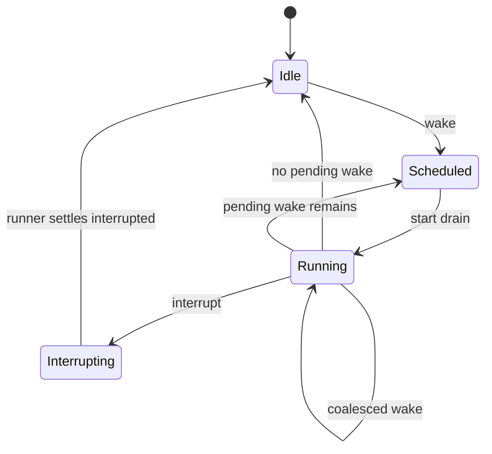

# 02 Session, Prompt Admission, and Run Coordination

This module is responsible for turning user input into a durable prompt and coordinating the serial execution of the same Session. Its core goals are: user input is first stored in the database, then triggers execution; only one local drain per Session at any given time; multiple different Sessions can run concurrently.

> Source code consistency note: The current V2 core `sessions.prompt(...)` requires an existing `sessionID` and does not implicitly create a Session; the upper layer needs to call `sessions.create(...)` first. The actual interface for `SessionExecution` is `resume(sessionID)`, `wake(sessionID, seq?)`, `interrupt(sessionID, seq?)`.

## Module Responsibilities

This module is responsible for:

- Creating or reusing Sessions.
- Receiving user prompts and persisting them to the Prompt Inbox.
- Determining, based on the delivery mode, whether to only store the input, merge it into the current activity, or queue it for a future activity.
- Waking up the `SessionRunner` to process eligible inputs.
- Coordinating in-process execution for the same Session to prevent two Runners from consuming the same batch of inputs.

This module is not responsible for:

- Constructing model requests.
- Invoking the LLM.
- Executing tools.
- Managing context budgets.

## Core Data Models

### Prompt Input

```ts
type PromptID = string

type PromptDelivery = "steer" | "queue"

type SessionInputRow = {
  id: PromptID
  sessionID: SessionID
  messageID: MessageID
  role: "user"
  parts: MessagePart[]
  delivery: PromptDelivery
  status: "admitted" | "promoted" | "canceled"
  resume: boolean
  createdAt: number
  promotedAt?: number
  idempotencyKey?: string
}
```

Semantics:

- `admitted` means it has entered the durable inbox but is not yet visible to the model.
- `promoted` means it has become a visible user message and can be seen in the next provider turn.
- `delivery = "steer"` represents the default behavior: if the current activity is running, the input will be merged into the activity at a safe boundary.
- `delivery = "queue"` means opening a future activity that will execute FIFO after the current activity completely finishes.
- `resume = false` means only store the input without waking execution, suitable for drafts, preloading, or batch imports from external systems.

### Session Activity

An activity table may not be needed in implementation, but conceptually it should exist:

```ts
type ActivityID = string

type SessionActivity = {
  id: ActivityID
  sessionID: SessionID
  promptIDs: PromptID[]
  state: "pending" | "running" | "settled" | "interrupted" | "failed"
  createdAt: number
  startedAt?: number
  settledAt?: number
}
```

Semantics:

- The same activity can contain multiple steer prompts.
- queue prompts default to opening a new activity.
- One drain of the Runner can process one or multiple activities, but only one activity is active at a time.

## Session API

```ts
interface SessionService {
  create(input: {
    agentID?: AgentID
    location: Location
    title?: string
    metadata?: Record<string, unknown>
  }): Promise<SessionRow>

  prompt(input: {
    sessionID?: SessionID
    agentID?: AgentID
    location: Location
    messageID?: MessageID
    parts: MessagePart[]
    delivery?: PromptDelivery
    resume?: boolean
    idempotencyKey?: string
  }): Promise<PromptAdmissionResult>

  interrupt(input: {
    sessionID: SessionID
    reason?: string
  }): Promise<void>
}

type PromptAdmissionResult = {
  session: SessionRow
  prompt: SessionInputRow
  wakeScheduled: boolean
}
```

Responsibilities of `prompt(...)`:

1. If no `sessionID` is provided, create a new Session.
2. If `sessionID` is provided, read the existing Session and adopt its agent and location.
3. Handle exact retries using `messageID` or `idempotencyKey`.
4. Write `SessionInputRow(status = "admitted")`.
5. Append the `prompt.admitted` event.
6. If `resume !== false`, call `SessionExecution.wake(sessionID)`.

## Prompt Admission

Admission is the durable boundary for "receiving input". It must occur before any model call.

```ts
interface SessionInputStore {
  admit(input: {
    sessionID: SessionID
    messageID?: MessageID
    parts: MessagePart[]
    delivery: PromptDelivery
    resume: boolean
    idempotencyKey?: string
  }): Promise<SessionInputRow>

  listAdmitted(sessionID: SessionID): Promise<SessionInputRow[]>
  markPromoted(input: { sessionID: SessionID; promptIDs: PromptID[] }): Promise<void>
  cancel(input: { sessionID: SessionID; promptID: PromptID; reason: string }): Promise<void>
}
```

### Exact Retry Rules

When a client times out, it may retry using the same `messageID` or `idempotencyKey`.

Retries should satisfy:

- If Session, messageID, parts, delivery, and resume are all identical, return the existing input.
- If messageID is the same but parts differ, reject and return a conflict.
- If messageID is the same but sessionID differs, reject.
- If a projected prompt already exists in history but the inbox record is missing, lazily synthesize a promoted input and then return success.

Pseudocode:

```ts
async function admitPrompt(input: AdmitPromptInput) {
  const existing = await store.findByMessageID(input.sessionID, input.messageID)
  if (!existing) return store.insertAdmitted(input)
  if (samePrompt(existing, input)) return existing
  throw new ConflictError("message id was reused with different prompt content")
}
```

## Prompt Promotion

Promotion is the boundary for "letting the model see user input". The Runner can only consume promoted messages.

```ts
interface PromptPromoter {
  promoteEligible(input: {
    sessionID: SessionID
    mode: "active-boundary" | "new-activity"
  }): Promise<SessionMessage[]>
}
```

Promotion rules:

- When drain starts, if there is no active activity, take the earliest batch of eligible inputs.
- `queue` inputs open a new activity in FIFO order.
- `steer` inputs can be merged into the current activity at a safe provider turn boundary.
- Do not modify the current request while the provider stream is outputting tokens; wait until the next provider turn.

Call chain:

```text
SessionRunner.drain(sessionID)
  -> PromptPromoter.promoteEligible(...)
  -> SessionInputStore.markPromoted(...)
  -> EventStore.append("prompt.promoted")
  -> Projection.projectMessages(...)
```

## Run Coordinator

The Coordinator is the in-process arbitration mechanism for Session drains.

```ts
interface SessionExecution {
  wake(sessionID: SessionID): void
  interrupt(sessionID: SessionID, reason?: string): void
  getState(sessionID: SessionID): SessionExecutionState
}

type SessionExecutionState = {
  sessionID: SessionID
  active: boolean
  wakePending: boolean
  activeRunID?: string
  interrupted: boolean
}
```

A local implementation can use `Map<SessionID, RunSlot>`:

```ts
type RunSlot = {
  running: boolean
  wakePending: boolean
  abortController?: AbortController
}
```

Pseudocode for `wake(sessionID)`:

```ts
function wake(sessionID: SessionID) {
  const slot = getOrCreateSlot(sessionID)
  slot.wakePending = true
  if (slot.running) return
  startDrain(sessionID, slot)
}

async function startDrain(sessionID: SessionID, slot: RunSlot) {
  slot.running = true
  try {
    while (slot.wakePending) {
      slot.wakePending = false
      await runner.drain(sessionID, { signal: slot.abortController.signal })
    }
  } finally {
    slot.running = false
    slot.abortController = undefined
    if (slot.wakePending) startDrain(sessionID, slot)
  }
}
```

Design points:

- Repeated wake calls for the same Session are coalesced; a second Runner is not started.
- If a prompt arrives while the Runner is running, only set `wakePending`, and the current drain will pick it up at a safe boundary.
- Different Sessions use different slots and can run concurrently.
- `interrupt` only affects the active drain owned by the current process; if there is no active drain, it is a no-op, but can still write an interrupt request event.

## State Machine



## Concurrency Semantics

### Same Session

- Drains for the same Session are serialized.
- New input does not interrupt the current provider stream; it will be promoted at the next safe boundary.
- Tool execution can be parallel, but tool settlement must be fully persisted within the same step before proceeding to the next provider turn.

### Different Sessions

- Different Sessions can drain simultaneously.
- Each drain uses its own Location to obtain tools, permissions, and context.
- Global resources, such as MCP server connection pools, can be shared, but calls must carry session/location context.

## Error Handling

It is recommended to classify errors into three categories:

```ts
type SessionError =
  | { type: "conflict"; message: string }
  | { type: "transient"; message: string; retryAfterMs?: number }
  | { type: "fatal"; message: string }
```

Handling strategies:

- `conflict` is returned directly to the client without retries.
- `transient` can retain the admitted input and wait for the next wake.
- `fatal` writes an event, marks the current activity as failed, but does not delete the input or event.

## Implementation Steps

1. Implement `SessionService.create/get`.
2. Implement `SessionInputStore.admit/listAdmitted/markPromoted`.
3. Implement durable admission for `prompt(...)`.
4. Implement same-Session serialization coalescing for `SessionExecution.wake`.
5. Implement `PromptPromoter` to convert admitted inputs into `prompt.promoted`.
6. Write an empty Runner that only prints promoted messages to verify the scheduling chain.

## Acceptance Criteria

- When `resume = false`, only an admitted input is created, and the Runner is not started.
- Submitting three inputs rapidly for the same Session starts only one active drain.
- Submitting a steer input while an active drain is running allows it to be seen in the next provider turn.
- A queue input is not inserted into the current activity but executes after the current activity is settled.
- Repeated submission of the same `messageID` with the same content returns the same input.
- Repeated submission of the same `messageID` with different content returns a conflict.

## Common Pitfalls

- Calling the model directly within `prompt(...)`, causing loss of user input if the process crashes.
- Treating wake as a reliable queue. Wake is only an advisory signal; the source of truth is the durable inbox.
- Starting multiple Runners for the same Session, causing two provider turns to consume the same batch of history.
- Inserting a new user message in the middle of a model streaming response, breaking provider request consistency.
