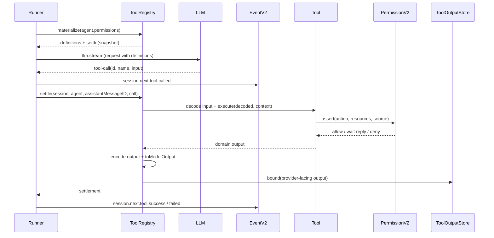

# 04 Tool Registration, Tool Execution, and Permission System

This chapter describes the tool system based on the current real implementation of opencode V2 core. The core conclusions are: tool definitions are opaque values, tools are named at registration time, ToolRegistry captures advertised registration identity during provider-turn materialization, and stale-call protection is applied during settlement; permissions are not automatically injected by the Registry based on risk fields, but trusted tools call `PermissionV2.assert(...)` within their own `execute`.

## Module Responsibilities

This module is responsible for:

- Defining the opaque tool model via `Tool.make(...)`.
- Providing scoped registration capability via `tools.register({ name: tool })`.
- Materializing currently visible tool definitions before each provider turn.
- Settling local tool calls returned by the model.
- Performing input decoding, execution, output encoding, model output projection, and output bounding during settlement.
- Supporting allow/ask/deny, pending requests, user replies, and project saved approvals via `PermissionV2`.

This module is NOT responsible for:

- The ToolRegistry does not actively parse file paths, commands, or URL risks; these are handled by specific tools within their execute.
- The ToolRegistry does not inject an `assertPermission` helper into tools; tools capture the services they need themselves.
- The ToolRegistry does not treat MCP/plugin/source/risk as core fields; these are registration sources or extension layer semantics.

## Current Tool Core API

Tool definitions are opaque types. Callers cannot read their schema, executor, or metadata; they can only use them through the Tool module and ToolRegistry.

```ts
type Definition<Input, Output>
type AnyTool = Definition<any, any>

type ToolConfig<Input, Output> = {
  description: string
  input: Schema.Codec<any, any, never, never>
  output: Schema.Codec<any, any, never, never>
  execute: (
    input: Schema.Type<Input>,
    context: ToolContext,
  ) => Effect<Schema.Type<Output>, ToolFailure>
  toModelOutput?: (input: {
    input: Schema.Type<Input>
    output: Output["Encoded"]
  }) => ReadonlyArray<ToolContent>
}

function make<Input, Output>(config: ToolConfig<Input, Output>): Definition<Input, Output>
```

Tool content only supports the model output parts currently needed by the core:

```ts
type ToolContent =
  | { type: "text"; text: string }
  | { type: "file"; data: string; mime: string; name?: string }
```

## Tool.Context

Each local tool execution receives the same invocation context:

```ts
interface ToolContext {
  sessionID: SessionID
  agent: AgentID
  assistantMessageID: MessageID
  toolCallID: ToolCallID
}
```

Design points:

- `assistantMessageID` is the durable assistant message ID containing this tool call.
- `toolCallID` is a provider-local call ID; it may repeat across provider turns, so it cannot be used alone as a durable identity.
- The Runner is responsible for binding `assistantMessageID` and `toolCallID` before passing to the registry.
- Tool input is decoded input, passed separately to `execute`, not placed in the context.

## Tool Naming and Registration

Tool values have no built-in name. The model-visible name comes from the key in the registration record.

```ts
interface Tools {
  register(
    tools: Readonly<Record<string, Tool.AnyTool>>,
  ): Effect<void, Tool.RegistrationError, Scope>
}
```

Example:

```ts
yield* tools.register({
  read,
  grep,
  bash,
})
```

Naming rule:

```ts
function validateName(name: string) {
  return /^[A-Za-z][A-Za-z0-9_-]{0,63}$/.test(name)
}
```

Implications:

- The record key is the effective model-facing name.
- The same reusable tool value can be registered multiple times with different names.
- Provider-specific additional restrictions that cannot be checked with a general grammar should fail during request preparation with a clear model compatibility error.

## Scoped Registration

ToolRegistry is Location-scoped. Registration is a scoped overlay:

- Within the same placement, the latest active registration wins.
- Closing a registration scope only removes that registration.
- If the winner is closed, the previous active registration with the same name is revealed.
- Modifying the registration record passed by the caller does not affect captured registrations.
- Location registrations take precedence over process application registrations.

```ts
type Registration = {
  identity: object
  tool: Tool.AnyTool
}

type LocalRegistry = Map<
  string,
  Array<{
    token: object
    registration: Registration
  }>
>
```

This design supports plugins or dynamic contributions:

```text
plugin scope opens
  -> tools.register({ custom_tool })
  -> provider turns can see custom_tool
plugin scope closes
  -> only this registration removed
  -> previous same-name registration, if any, becomes visible again
```

## ToolRegistry Interface

Current core interface:

```ts
interface ToolRegistry {
  materialize(permissions?: PermissionRuleset): Effect<Materialization>

  register(
    tools: Readonly<Record<string, Tool.AnyTool>>,
  ): Effect<void, Tool.RegistrationError, Scope>
}

type Materialization = {
  definitions: ReadonlyArray<ModelToolDefinition>
  settle(input: ExecuteInput): Effect<Settlement, ToolOutputStoreError>
}

type ExecuteInput = {
  sessionID: SessionID
  agent: AgentID
  assistantMessageID: MessageID
  call: ToolCall
}

type Settlement = ToolSettlement & {
  outputPaths?: ReadonlyArray<string>
}
```

`materialize(...)` is called during provider turn preparation. It:

1. Merges process application tools and Location-local tools.
2. Location-local tools with the same name override application tools.
3. Filters out wholly disabled tools based on agent permissions.
4. Generates provider-facing tool definitions for each advertised name.
5. Captures a snapshot of name -> registration identity.
6. Returns a `settle(...)` function bound to this snapshot.

## Tool Call Chain in Provider Turn

```text
Runner
  -> tools.materialize(agent.permissions)
  -> LLM.request({ tools: materialization.definitions })
  -> llm.stream(request)
  -> LLMEvent.tool-call(local)
  -> publish session.next.tool.called
  -> materialization.settle({ sessionID, agent, assistantMessageID, call })
  -> publish LLMEvent.tool-result
  -> publish session.next.tool.success / failed
  -> reload projected history before continuation
```

Note:

- Provider-executed tool calls do NOT go through local registry settlement.
- Local tool calls must durably publish `session.next.tool.called` before starting local side effects.
- The Runner eagerly starts a local settlement fiber, but after the provider stream ends, it must wait for all settlements to complete.

## Settlement Detailed Flow

```ts
function settle(input: ExecuteInput, advertised?: object): Effect<Settlement> {
  const current = resolveEffectiveRegistration(input.call.name)

  if (!current) {
    return modelVisibleError(
      advertised ? `Stale tool call: ${input.call.name}` : `Unknown tool: ${input.call.name}`,
    )
  }

  if (advertised && current.identity !== advertised) {
    return modelVisibleError(`Stale tool call: ${input.call.name}`)
  }

  const output = Tool.settle(current.tool, input.call, {
    sessionID: input.sessionID,
    agent: input.agent,
    assistantMessageID: input.assistantMessageID,
    toolCallID: input.call.id,
  })

  const bounded = ToolOutputStore.bound({
    sessionID: input.sessionID,
    toolCallID: input.call.id,
    output,
  })

  return toSettlement(bounded)
}
```

Settlement guarantees:

- Unknown calls become model-visible errors; handler is not called.
- Stale calls become model-visible errors; handler is not called.
- Invalid input does NOT call the handler.
- Invalid output from handler does NOT produce a successful settlement.
- Expected `ToolFailure` becomes a model-visible tool error.
- Interruption and defect should not be swallowed by the tool and disguised as success or ordinary failure.

## Codec Boundaries

`Tool.make` uses Effect Schema codecs:

```text
provider raw input
  -> decode input codec
  -> execute(decoded input, Tool.Context)
  -> encode output codec
  -> toModelOutput({ input, encoded output })
  -> ToolOutput
  -> ToolOutputStore.bound
  -> provider-facing tool result
```

Constraints:

- Execution only observes decoded input.
- `toModelOutput` only observes decoded input and encoded output.
- `toModelOutput` must be a pure, total function.
- `toModelOutput` does NOT receive session, agent, toolCallID, or other invocation identity.

## Output Projection and Bounding

Tools return complete domain output; they do not truncate content for the model internally.

Output processing boundaries:

1. Output codec validates the tool's return value.
2. `toModelOutput` generates model-visible content.
3. If there is no content and the encoded output is a string, it defaults to text projection.
4. ToolOutputStore performs unified bounding on provider-facing text/structured output.
5. Oversized output is saved to managed storage, and provider-facing text is replaced with a bounded preview.
6. Structured metadata and native media are preserved under producer-owned limits.

Design points:

- Tools should not discard domain output to fit the model's context window.
- If full retention fails, settlement should operationally fail rather than publishing a lossy success.
- The current public Session API may still expose managed `outputPaths`; completely opaque managed-output references are a future design.

## Failure Semantics

Tool failure layers:

- `ToolFailure`: A recoverable failure intentionally categorized by the tool and visible to the model.
- Invalid input: Model-visible settlement error; handler is not called.
- Invalid output: Settlement fails; success is not published.
- Interruption: The invocation is canceled; should not become an ordinary tool result.
- Defect/unexpected typed error: Falls to the Runner's operational failure policy.

Tool implementations should not broadly catch all errors, as this would swallow interruptions and defects.

## PermissionV2 Core Model

Current permissions are not a scope/matcher object model, but action/resource/effect rules.

```ts
type PermissionEffect = "allow" | "ask" | "deny"

type PermissionRule = {
  action: string
  resource: string
  effect: PermissionEffect
}

type PermissionRuleset = PermissionRule[]
```

Matching rule:

```ts
function evaluate(action: string, resource: string, ...rulesets: PermissionRuleset[]): PermissionRule {
  return (
    rulesets
      .flat()
      .findLast((rule) => wildcard(rule.action, action) && wildcard(rule.resource, resource))
    ?? { action, resource: "*", effect: "ask" }
  )
}
```

Default is `ask` when no matching rule is found.

## Permission Request

```ts
type PermissionAssertInput = {
  id?: PermissionID
  sessionID: SessionID
  agent?: AgentID
  action: string
  resources: string[]
  save?: string[]
  metadata?: Record<string, unknown>
  source?: {
    type: "tool"
    messageID: string
    callID: string
  }
}

type PermissionReplyInput = {
  requestID: PermissionID
  reply: "once" | "always" | "reject"
  message?: string
}
```

Events:

```text
permission.v2.asked
permission.v2.replied
```

## PermissionService Interface

```ts
interface PermissionService {
  ask(input: PermissionAssertInput): Effect<{
    id: PermissionID
    effect: "allow" | "ask" | "deny"
  }>

  assert(input: PermissionAssertInput): Effect<void, PermissionError>

  reply(input: PermissionReplyInput): Effect<void>

  get(id: PermissionID): Effect<PermissionRequest | undefined>
  forSession(sessionID: SessionID): Effect<ReadonlyArray<PermissionRequest>>
  list(): Effect<ReadonlyArray<PermissionRequest>>
}
```

`assert(...)` semantics:

```text
load configured agent rules
  -> if any requested resource evaluates deny under agent rules: DeniedError
  -> merge agent rules + saved project approvals
  -> evaluate every resource
  -> all allow: return
  -> any ask: publish permission.v2.asked, wait pending Deferred
  -> reply once: allow current request only
  -> reply always: save project approval for input.save resources, allow matching pending requests
  -> reply reject: reject current request and same-session pending requests
```

## How Tools Use Permissions

Trusted tools call the permission service within `execute`. Example:

```ts
const grep = Tool.make({
  description: "Search file contents",
  input: GrepInput,
  output: GrepOutput,
  execute: (input, context) =>
    Effect.gen(function* () {
      const root = yield* filesystem.resolveRoot(input)

      yield* permission.assert({
        sessionID: context.sessionID,
        agent: context.agent,
        source: {
          type: "tool",
          messageID: context.assistantMessageID,
          callID: context.toolCallID,
        },
        action: "grep",
        resources: [input.pattern],
        save: ["*"],
        metadata: { root: root.resource },
      })

      return yield* filesystem.grep(input, root)
    }),
})
```

Key points:

- The Registry does not know the path/pattern semantics of grep.
- The tool itself decides action, resources, save, and metadata.
- `source` binds to assistant message and call ID, allowing the permission UI to trace back to the specific tool call.

## Agent Permissions and Tool Visibility

ToolRegistry materialization filters out "wholly disabled" tools based on agent permissions.

Current rule:

```ts
function whollyDisabled(action: string, rules: PermissionRuleset) {
  const rule = rules.findLast((rule) => wildcard(rule.action, action))
  return rule?.resource === "*" && rule.effect === "deny"
}
```

Tools can use `Tool.withPermission(tool, permissionAction)` to change the action used for visibility filtering; otherwise, the registered name is used by default.

Implications:

- If an agent rule has `resource = "*"` and `effect = "deny"` for an action, that tool is not exposed to the model.
- This is only visibility filtering; it does not replace permission assert during tool execution.
- When a Session does not have an explicit agent, execution and permission evaluation should use a default build agent to avoid inconsistencies between model behavior and permission policy.

## Built-in Tool Permission Practices

### Read-like Tools

Current design focus for read:

```text
resolve one path relative to Location or named project reference
-> reject absolute paths, path escapes, symlink escapes
-> authorize read against canonical resource identity
-> file: return UTF-8 text or base64 binary content
-> oversized UTF-8 text: bounded line ranges
-> directory: direct children, directory-first alphabetical order
-> directory paging: one-based offset + next cursor
```

### Bash

V2 bash permission semantics:

- Default is `ask` when no matching rule exists.
- Uses configured agent rules + saved project approvals.
- Bash does NOT provide sandboxing; the spawned shell has the host user's file, process, and network permissions.
- External workdir resolution is enforced by `external_directory` authority check.
- Scanning of absolute command arguments is only advisory warning, not a sandbox boundary.

### Apply Patch

V2 apply_patch leaf:

- Supports add/update/delete hunks.
- Parses all hunks.
- Resolves all mutation targets.
- Approves external directories.
- Approves one edit batch.
- Preflights update/delete targets.
- On commit, executes sequentially; failure mid-way leaves earlier operations and returns a partial-application report.
- Move and atomic rollback are future designs, not currently implied capabilities.

## Placement of MCP, Plugin, and Skill Tools

MCP/plugin/Skill tools should not bypass this core.

Recommendation for implementation:

```text
MCP discovery / plugin load / skill load
  -> construct Tool.make(...)
  -> tools.register({ public_name: tool }) in an owned Scope
  -> provider turn materialize captures identity
  -> settlement calls underlying MCP/plugin/skill handler
  -> handler performs PermissionV2.assert if needed
```

Naming conventions can still be used:

```text
mcp__server__tool
plugin__plugin__tool
skill__skill__tool
```

But these are registration name conventions, not core ToolDefinition fields.

## End-to-End Call Chain



## Implementation Steps

1. Implement opaque `Tool.make` using WeakMap to store private runtime.
2. Implement input decode, execute, output encode, toModelOutput.
3. Implement `Tools.register(record)`, validate names, and bind Scope finalizer.
4. Implement local overlay stack: latest wins, scope close reveals previous.
5. Implement precedence for application tools and Location tools.
6. Implement `materialize(permissions)` to generate definitions and capture registration identity.
7. Implement settlement stale rejection.
8. Implement `ToolOutputStore.bound`.
9. Implement `PermissionV2.evaluate/ask/assert/reply`.
10. Call `PermissionV2.assert` inside built-in tools.
11. Connect the Runner's local `tool-call` to the materialized `settle`.

## Acceptance Criteria

- Registration fails for illegal tool names.
- Later registration of a tool with the same name overrides earlier registration; closing the later registration restores the earlier one.
- After provider turn materialization, if a tool is replaced, tool calls from the old turn are stale-rejected.
- Invalid input does not call execute.
- Invalid output does not publish success.
- `ToolFailure` becomes a model-visible tool error.
- Oversized tool output is retained in managed storage, with a bounded preview provided to the model.
- A deny rule with resource `*` causes the corresponding tool not to be exposed to the model.
- No matching permission defaults to ask.
- A reply of `always` saves project approval and automatically allows matching pending requests.
- A reply of `reject` rejects pending requests in the same session.

## Common Pitfalls

- Giving tool values a built-in name, preventing the same tool from being registered under multiple names.
- Exposing tool schema/executor as public fields, breaking opaque law.
- Copying only definitions during materialization without capturing registration identity, allowing stale calls to execute new handlers.
- Doing permission checks at the registry layer based on generalized risk fields, losing the path/command/resource semantics of specific tools.
- Tools catching all exceptions and returning strings, swallowing interruptions and defects.
- Truncating output inside tools, causing complete results to not be retained.
- Allowing MCP/plugin tools to bypass ToolRegistry and PermissionV2.
