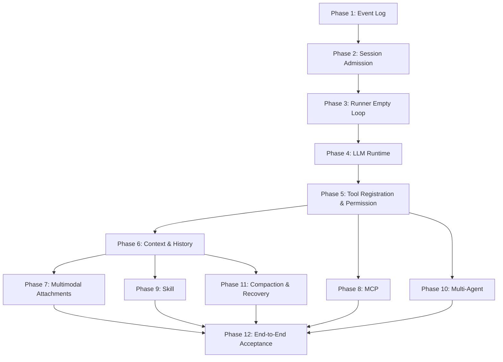

# 11: From-Scratch Replication Roadmap and Acceptance Checklist

This roadmap connects the previous 10 modules into an executable development plan. It is recommended to submit work by phase, with each phase delivering a minimal, independently runnable闭环. Avoid trying to implement real models, MCP, multimodality, and sub-agents simultaneously from the start.

## Overall Milestones



## Phase 1: Event Log and Domain Model

Deliverables:

- `SessionStore`
- `EventStore`
- `AttachmentBlobStore`
- Basic ID generator
- `HistoryProjection.projectMessages`

Minimal interface:

```ts
interface EventStore {
  append(input: AppendEventInput): Promise<EventRow>
  list(input: ListEventInput): Promise<EventRow[]>
}
```

Acceptance criteria:

- Manually writing user/assistant/tool events can be projected into messages.
- Events remain readable after a restart.
- Sequence numbers increase monotonically within a session.

## Phase 2: Session Admission

Deliverables:

- `SessionService.prompt`
- `SessionInputStore`
- `prompt.admitted/promoted` events
- Exact retry with conflict detection

Acceptance criteria:

- Prompt is first stored in the database, then triggers a wake.
- `resume = false` only stores the prompt without running it.
- Retry behavior with the same messageID is correct.

## Phase 3: Run Coordinator and Empty Runner

Deliverables:

- `SessionExecution.wake/interrupt/getState`
- Serial draining within the same session
- Empty runner performs only promotion, no model invocation

Acceptance criteria:

- Multiple wake calls within the same session are merged.
- Different sessions can run concurrently.
- `interrupt` allows an active drain to receive an abort signal.

## Phase 4: LLM Runtime

Deliverables:

- `LLMRuntimeRegistry`
- One fake provider
- One real provider adapter
- Provider-neutral stream events

Acceptance criteria:

- A simple prompt can generate assistant text.
- Provider errors are standardized and logged as events.
- One provider turn invokes `llm.stream(request)` only once.

## Phase 5: Tool Registration, Execution, and Permissions

Deliverables:

- `Tool.make(...)` for opaque tool definitions
- `ToolRegistry`
- `ToolSettlement`
- `PermissionService`
- Built-in read-only tools, file-writing tools, and shell tools

Acceptance criteria:

- The model can call read-only tools and see results in the next turn.
- File writing and shell commands trigger permission pending by default.
- After the user denies permission, the model receives a rejection result.
- Tools are not executed if their parameters are invalid.

## Phase 6: Context Management and History Projection

Deliverables:

- `HistorySelector`
- `ContextSourceRegistry`
- `ContextEpochService`
- Token estimator

Acceptance criteria:

- Each provider turn has a Context Epoch.
- The Epoch records system, history IDs, tool names, and source hashes.
- When history is too long, it can be trimmed without breaking tool pairs.

## Phase 7: Multimodal Attachments

Deliverables:

- Draft attachment state in the chat box
- `AttachmentResolver`
- `ImageNormalizer`
- `ModelPartBuilder`
- Provider multimodal mapping

Acceptance criteria:

- After pasting a screenshot, a multimodal model can read it.
- Models that do not support images explicitly reject them.
- Local paths are not sent directly as text paths to cloud models.
- Large files are rejected or handled via blob/preprocessing.

## Phase 8: MCP Integration

Deliverables:

- `MCPClientManager`
- Discovery snapshot
- Conversion of MCP tools to `Tool.make(...)` tool values
- MCP resource/prompt services

Acceptance criteria:

- MCP tools have stable namespaces.
- MCP tool execution follows unified permission rules.
- A server failure does not crash the entire agent.
- Resources can be selected by the user to enter the context.

## Phase 9: Skill System

Deliverables:

- `SkillDiscovery`
- `SkillRegistry`
- `SkillSelector`
- Skill Context Source

Acceptance criteria:

- Explicit skills can inject a Context Epoch.
- Unmatched skills do not enter the prompt.
- Skill resources are read on demand.
- Skill script execution follows permission rules.

## Phase 10: Multi-Agent and Sub-Agents

Deliverables:

- `AgentService`
- `task` tool
- Child sessions
- Sub-agent permission inheritance and depth limits

Acceptance criteria:

- The main agent can create a child session via `task`.
- Sub-agent results return to the parent session as tool results.
- Permissions are not unconditionally inherited.
- `maxDepth` is enforced.

## Phase 11: Compaction, Interruption, and Recovery

Deliverables:

- `CompactionService`
- Compaction summary Context Source
- `StartupRecovery`
- Interruption state logged as events

Acceptance criteria:

- State after interrupting a provider/tool can be interpreted.
- Running states are cleaned up after a restart.
- Compaction does not delete original events.
- A summary can replace early history in the context.

## Phase 12: End-to-End Acceptance

End-to-end scenario 1: Plain text

```text
User submits text
  -> prompt admitted/promoted
  -> Runner invokes model
  -> Assistant text logged as event
  -> UI projection displays reply
```

End-to-end scenario 2: Tool call

```text
User requests to read a file
  -> Model calls read_file
  -> ToolRegistry resolves
  -> Permission allows
  -> Tool result logged as event
  -> Runner gives tool result to model in next turn
  -> Model summarizes
```

End-to-end scenario 3: Permission

```text
User requests to execute a command
  -> Model calls shell
  -> Permission asks
  -> UI displays request
  -> User denies
  -> Tool fails with denied
  -> Model receives rejection and adjusts response
```

End-to-end scenario 4: Multimodal

```text
User pastes an image and asks a question
  -> Attachment resolver saves blob
  -> Capability check performed
  -> Image part enters ModelRequest
  -> Model answers question about the image
```

End-to-end scenario 5: MCP

```text
Start MCP server
  -> Discover tools
  -> Register mcp__server__tool
  -> Model calls MCP tool
  -> Permission ask/allow
  -> Result returned as a normal tool result
```

End-to-end scenario 6: Sub-agent

```text
Main agent calls task
  -> Child session created
  -> Child Runner completes task
  -> Result returned to parent session
  -> Parent agent continues reasoning
```

## Overview of Minimal Core Interfaces

```ts
interface CoreServices {
  sessionStore: SessionStore
  eventStore: EventStore
  sessionInputStore: SessionInputStore
  sessionService: SessionService
  sessionExecution: SessionExecution
  runner: SessionRunner
  llm: LLMRuntime
  toolRegistry: ToolRegistry
  toolSettlement: ToolSettlement
  permissionService: PermissionService
  projection: HistoryProjection
  historySelector: HistorySelector
  contextEpoch: ContextEpochService
  attachmentResolver: AttachmentResolver
  agentService: AgentService
  mcp?: MCPClientManager
  skills?: SkillRegistry
  compaction?: CompactionService
}
```

## Key Invariants

- User input must go through admission before wake.
- `prompt admitted` does not mean visible to the model; `promoted` does.
- Only one active drain can exist for a given session at a time.
- Only one `llm.stream(request)` call per provider turn.
- Tool calls must go through registry resolve, schema validation, permission assertion, execution, and event appending.
- Permission decisions are made on the server side, not solely by the UI.
- Context Epoch must be persisted before the provider turn.
- Multimodal attachments must undergo capability checks; local paths cannot be sent directly to cloud models.
- Both MCP and Skills go through unified registration/context/permission pipelines.
- Sub-agents must have child sessions, not run covertly in memory.
- Compaction does not delete original events.
- Do not automatically retry provider work after a crash unless a clear recovery design exists.

## Recommended Testing Matrix

| Module | Unit Tests | Integration Tests |
| --- | --- | --- |
| EventStore | sequence/idempotency | Projection after restart |
| Session | exact retry/promotion | Merging multiple wakes |
| Runner | stream event consumption | Tool loop |
| Runtime | provider mapping | Fake provider E2E |
| Tool | schema validation | Permission allow/deny |
| Permission | rule matching | UI response |
| Context | token budget | Epoch replay |
| Attachment | MIME/size/path | Image input E2E |
| MCP | name mapping | MCP tool call |
| Skill | trigger selection | Guidance in epoch |
| Subagent | depth limit | Task result |
| Recovery | cleanup rules | Crash simulation |

## Development Task Breakdown Suggestions

- First, get the fake provider working, then connect the real model.
- Implement read-only tools first, then write tools and shell.
- Implement ask/deny/allow once first, then persistent session/workspace authorization.
- Support images first, then PDFs, audio, and tool-mediated media.
- Start with local MCP stdio, then remote HTTP.
- Start with one sub-agent executing serially, then add concurrency and depth strategies.
