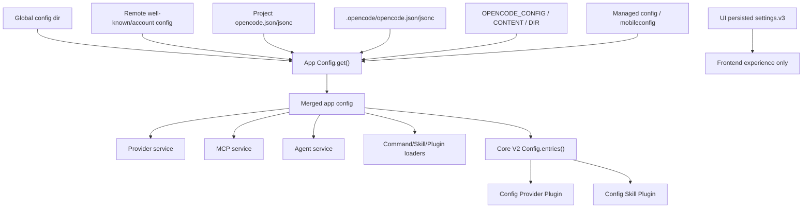

# 11 Settings, Configuration Persistence, and Import Activation

This chapter completes the configuration and settings system for opencode. Two layers must be distinguished:

- **Core/App Configuration**: Written in sources such as `config.json`, `opencode.json`, `opencode.jsonc`, remote well-known config, managed config, environment variables, etc. Affects runtime capabilities of Agent, Provider, Permission, MCP, Skill, Command, Attachments, Compaction, Plugins, etc.
- **Frontend UI Settings**: Stored in browser/desktop frontend local persistent storage, such as fonts, layout toggles, notification sounds, local UI expansion states, auto-approval UI preferences, etc. These typically do not participate in core config merging and do not alter the server-side runtime state of the provider/tool registry.

When replicating, do not mix these two layers. Server-side configuration is instance/location runtime input; frontend settings are client-side experience preferences.

## Module Responsibilities

This module is responsible for:

- Discovering global, project, directory, environment, remote, and managed configurations.
- Parsing JSON/JSONC, supporting V1 configuration migration to V2 core schema.
- Handling `{env:VAR}` and `{file:path}` variable substitutions.
- Merging configurations by priority and preserving entry sources.
- Importing configuration into subsystems such as Provider Catalog, Skill Source, Plugin, Permission, MCP, and Agent.
- Supporting API configuration updates and triggering instance reloads or invalidations.
- Persisting frontend UI settings.

## Configuration Hierarchy Overview



## Core V2 Config Service

The configuration service interface in V2 core is very small:

```ts
interface CoreConfigService {
  /** location config documents and supplemental directories from lowest to highest priority */
  entries(): Effect<ConfigEntry[]>
}

type ConfigEntry =
  | {
      type: "document"
      path?: string
      info: ConfigInfo
    }
  | {
      type: "directory"
      path: string
    }
```

`entries()` returns a **list of discovered, parsed, migrated, and priority-sorted configuration entries**, not a deeply merged object. This allows plugins to decide for themselves how to interpret "later overrides earlier."

### Core ConfigInfo

The V2 core schema mainly includes:

```ts
type ConfigInfo = {
  $schema?: string
  shell?: string
  model?: string
  default_agent?: string
  autoupdate?: boolean | "notify"
  share?: "manual" | "auto" | "disabled"
  enterprise?: { url?: string }
  username?: string
  permissions?: PermissionRuleset
  agents?: Record<string, AgentConfig>
  snapshots?: boolean
  watcher?: WatcherConfig
  formatter?: FormatterConfig
  lsp?: LspConfig
  attachments?: AttachmentsConfig
  tool_output?: ToolOutputConfig
  mcp?: MCPConfig
  compaction?: CompactionConfig
  skills?: string[]
  commands?: Record<string, CommandConfig>
  instructions?: string[]
  references?: ReferenceConfig
  plugins?: PluginSpec[]
  experimental?: ExperimentalConfig
  providers?: Record<string, ProviderConfig>
}
```

## Core Configuration Discovery Order

Key rules for Core V2 Location config discovery:

```text
global config directory
  -> config.json
  -> opencode.json
  -> opencode.jsonc
  -> directory marker

walk upward from Location.directory to project root
  -> direct project config files: config/opencode/opencode.jsonc
  -> .opencode directories

apply lower priority first, higher priority last
```

Actual intent:

- Global configuration has the lowest priority.
- Project-level upper configuration has lower priority than configuration closer to the current Location.
- `.opencode` directories can contribute both config files and supplemental directories.
- Config closer to the opened directory should override upper-level config.
- Core `entries()` is read once when Location is opened; subsequent calls reuse this snapshot until the Location/instance is reopened.

## Config.latest

Core provides a utility function to read the latest scalar:

```ts
function latest<K extends keyof ConfigInfo>(
  entries: readonly ConfigEntry[],
  key: K,
): ConfigInfo[K] | undefined {
  return entries
    .filter((entry): entry is ConfigDocument => entry.type === "document")
    .findLast((entry) => entry.info[key] !== undefined)
    ?.info[key]
}
```

Usage:

- Default model: `Config.latest(entries, "model")`
- Default agent: `Config.latest(entries, "default_agent")`
- Other scalar configurations.

Object-type configurations are typically processed by plugins entry by entry, rather than a simple `latest`.

## JSON/JSONC Parsing and V1 Migration

Core V2 supports:

- `config.json`
- `opencode.json`
- `opencode.jsonc`
- JSONC trailing commas
- V1 configuration detection and migration

Parsing flow:

```text
read file text
  -> jsonc parse with errors
  -> if parse errors: ignore file in core V2 location loader
  -> if V1 shape: decode V1, migrate to V2, decode V2
  -> if V2 shape: decode V2
  -> unknown extra property ignored by core V2 decoder
  -> Config.Document(path, info)
```

The application-side config parser is stricter: it reports JSONC parse errors, schema errors, and top-level unrecognized keys. This is because the CLI/API needs to provide actionable errors to users, while the core V2 location loader should avoid letting one bad configuration crash the entire runtime.

## Policy Loading

Core V2 loads experimental policies from config entries:

```text
configs
  -> documents reversed
  -> flatMap(info.experimental.policies)
  -> Policy.load(...)
```

Note: Policy rules use the reverse order of normal settings, allowing user-global rules to override repository rules; statement order within the same file remains unchanged.

## Application-Side Config Service

The application-side configuration service is responsible for loading, merging, updating, and invalidating the "full configuration":

```ts
interface AppConfigService {
  get(): Effect<AppConfig>
  getGlobal(): Effect<AppConfig>
  getConsoleState(): Effect<ConsoleState>
  update(config: AppConfig): Effect<void>
  updateGlobal(config: AppConfig): Effect<{ info: AppConfig; changed: boolean }>
  invalidate(): Effect<void>
  directories(): Effect<string[]>
  waitForDependencies(): Effect<void>
}
```

### get()

`get()` uses InstanceState to cache the merged configuration of the current instance:

```text
InstanceContext(directory, worktree)
  -> loadInstanceState(ctx)
  -> return state.config
```

This means configuration does not rescan files on every request. After modifying configuration, you typically need to:

- Call `invalidate()` to clear the global cache, or
- Mark the instance as dispose/reopen, allowing the Location runtime to re-read the configuration.

HTTP config update currently does:

```text
PATCH /config
  -> Config.update(payload)
  -> markInstanceForDisposal(currentInstanceContext)
  -> return payload
```

That is, after writing, it does not perform partial hot swapping of all services within the old runtime; instead, it takes effect after the instance is rebuilt.

## Application-Side Loading Order

The merge sources for application-side `loadInstanceState` are richer:

```text
1. auth well-known remote config
2. global config files
3. OPENCODE_CONFIG specified file
4. project config files, unless OPENCODE_DISABLE_PROJECT_CONFIG
5. config directories: global, project .opencode, home .opencode, OPENCODE_CONFIG_DIR
6. command/agent/plugin auto-discovery under config directories
7. OPENCODE_CONFIG_CONTENT
8. active account/org remote config
9. managed config directory
10. macOS managed preferences/mobileconfig
11. environment flag overrides
12. legacy compatibility transforms
```

Overall principles:

- Merge lower priority first, then higher priority.
- Deep merge for plain objects.
- `instructions` array uses deduplicated concatenation, not later completely replacing earlier.
- Plugin specs retain origin: source file + global/local scope.

## Global Configuration Persistence

Global configuration file selection:

```text
Global.Path.config/opencode.jsonc
Global.Path.config/opencode.json
Global.Path.config/config.json
```

Selection rules:

- If a file already exists, use the first existing candidate.
- If none exists, create the first candidate by default.
- When `OPENCODE_CONFIG`, `OPENCODE_CONFIG_DIR`, and `OPENCODE_CONFIG_CONTENT` are not set, seed a default global configuration containing only `$schema` to facilitate editor autocompletion.

Update interface:

```ts
updateGlobal(configPatch)
  -> read selected global config file
  -> remove derived fields such as plugin_origins
  -> normalize shell "" to undefined
  -> if JSON: deep merge and stringify
  -> if JSONC: apply jsonc-parser modify edits, preserving comments as much as possible
  -> write if changed
  -> invalidate global cache
  -> return { info, changed }
```

## Instance Configuration Persistence

Instance/directory configuration update:

```ts
update(config)
  -> dir = current InstanceState.directory
  -> file = path.join(dir, "config.json")
  -> existing = loadFile(file)
  -> write JSON.stringify(deepMerge(existing, writable(config)), 2)
```

Note:

- This writes to `config.json` under the current instance directory.
- It does not directly modify all project/global config sources.
- After writing, the HTTP handler marks the instance for disposal, allowing the configuration to take effect through rebuilding.

## Environment Variables and Content Injection

Supported key entry points:

```text
OPENCODE_CONFIG
OPENCODE_CONFIG_DIR
OPENCODE_CONFIG_CONTENT
OPENCODE_DISABLE_PROJECT_CONFIG
OPENCODE_PERMISSION
```

Variable substitution in configuration text:

```text
{env:VAR_NAME}
{file:relative/or/absolute/path}
```

Substitution rules:

- `{env:VAR}` takes value from passed env or process env, empty string if missing.
- `{file:path}` resolves relative to the configuration file's directory.
- `~/` expands to home directory.
- `{file:...}` within `//` comment lines is not replaced.
- File content is trimmed, then JSON string escaped before insertion.
- Missing file defaults to InvalidError; can configure missing to empty.

## Remote and Managed Configuration

### Well-known Remote Config

For well-known account/auth sources:

```text
auth entry type wellknown
  -> GET {url}/.well-known/opencode
  -> read wellknown.config
  -> optional remote_config.url + headers
  -> fetch remote config
  -> merge wellknown config + fetched config
  -> load as virtual config source
```

Remote URLs and headers support variable substitution.

### Active Account Config

If an active org exists:

```text
account.config(accountID, orgID)
  -> merge as global source
  -> provider IDs from this source marked console-managed
  -> token written to OPENCODE_CONSOLE_TOKEN env
```

### Managed Config Directory

Platform default paths:

```text
macOS: /Library/Application Support/opencode
Windows: %ProgramData%/opencode
Linux: /etc/opencode
```

Read from these:

```text
opencode.json
opencode.jsonc
```

### macOS Managed Preferences

macOS supports MDM/mobileconfig:

```text
domain: ai.opencode.managed
paths:
  /Library/Managed Preferences/{user}/ai.opencode.managed.plist
  /Library/Managed Preferences/ai.opencode.managed.plist
```

After reading, convert to JSON using `plutil -convert json`, remove plist metadata keys, then merge as the highest priority managed config.

## Import Activation into Provider

Provider configuration is not directly applied within ConfigService, but transformed into catalog via config provider plugin:

```text
Config.entries()
  -> ConfigProviderPlugin
  -> catalog.transform(...)
```

Activation rules:

- `model` scalar sets the default provider/model.
- `providers.{id}.name/env/api/request` updates provider.
- `providers.{id}.models.{modelID}` updates model family/name/api/capabilities/request/variants/cost/disabled/limit.
- Request body undergoes AISDK options normalization according to provider package.
- Later config entries override or append previous provider/model fields.

## Import Activation into Skill

Skill sources are activated via config skill plugin:

```text
Config.entries()
  -> directories entries
    -> {dir}/skill
    -> {dir}/skills
  -> document.info.skills
    -> URL source if http(s)
    -> ~/ expanded against global home
    -> relative path resolved against Location.directory
  -> SkillV2 transform adds sources
```

This explains why `.opencode/skill`, `.opencode/skills`, global skills, and skill paths in configuration are all discovered.

## Import Activation into Agent, Command, Plugin

Application-side automatically discovers in config directories:

```text
ConfigCommand.load(dir)
ConfigAgent.load(dir)
ConfigAgent.loadMode(dir)
ConfigPlugin.load(dir)
```

And merges into:

```ts
result.command
result.agent
result.plugin
result.plugin_origins
```

`mode` is compatibly migrated to agent:

```text
for each result.mode[name]:
  result.agent[name] = { ...mode, mode: "primary" }
```

Plugin origins record source and scope for subsequent installation, write-back, and diagnostics.

## Import Activation into Permission

Permission sources have several layers:

- core V2 `permissions`: `PermissionSchema.Ruleset`
- legacy/app `permission`
- legacy `tools` map compatibly converted to permission
- `OPENCODE_PERMISSION` environment variable JSON
- PermissionV2 saved project approvals

Legacy `tools` compatibility:

```text
tools.write/edit/patch -> permission.edit
tools.{name}: true  -> allow
tools.{name}: false -> deny
```

V2 ToolRegistry materialization uses agent permission rules to filter wholly disabled tools; specific tool execution still calls PermissionV2.assert.

## Import Activation into MCP

MCP service reads the merged app config:

```text
config.get().mcp
  -> build configured MCP clients
  -> dynamic add/remove/toggle updates runtime state
```

Note:

- The toggle state in MCP UI belongs to app runtime/global sync semantics.
- MCP/plugin tool materialization in V2 runner is still partial/follow-up; when replicating full implementation, MCP tools should be converted to `Tool.make(...)` and activated via scoped registration.

## Frontend UI Settings Persistence

Frontend settings use local persistence:

```ts
persisted("settings.v3", createStore(defaultSettings))
```

Typical fields:

```ts
type UISettings = {
  general: {
    autoSave: boolean
    releaseNotes: boolean
    followup: "queue" | "steer"
    showFileTree: boolean
    showNavigation: boolean
    showSearch: boolean
    showStatus: boolean
    showTerminal: boolean
    showReasoningSummaries: boolean
    shellToolPartsExpanded: boolean
    editToolPartsExpanded: boolean
    showSessionProgressBar: boolean
    showCustomAgents: boolean
    newLayoutDesigns?: boolean
  }
  appearance: {
    fontSize: number
    mono: string
    sans: string
    terminal: string
  }
  keybinds: Record<string, string>
  permissions: {
    autoApprove: boolean
  }
  notifications: NotificationSettings
  sounds: SoundSettings
}
```

Activation method:

- Font settings write CSS variables via reactive effect.
- Keybinds are read by command context.
- Notifications/sounds are read by notification context.
- `permissions.autoApprove` is part of UI auto-response strategy, not equivalent to server-side PermissionV2 allow rule.
- `general.followup = "queue"` is currently migrated back to `"steer"`, indicating the UI retains old options but actually disables queue followup preference.

## Configuration Update API

HTTP API:

```text
GET   /config
PATCH /config
GET   /config/providers
```

Processing logic:

```text
GET /config
  -> Config.get()

PATCH /config
  -> Config.update(payload)
  -> markInstanceForDisposal(current context)
  -> return payload

GET /config/providers
  -> Provider.list()
  -> public provider info + default model IDs
```

Design implications:

- PATCH only writes config to the current instance directory.
- Takes effect via dispose/reopen after writing, not hot-swapping all running services.
- UI should refresh or wait for instance reconnection after return.

## Configuration Change Activation Matrix

| Config Category | Reader | Activation Timing |
| --- | --- | --- |
| `model` | ConfigProviderPlugin / Agent resolution | After Location/instance opens or rebuilds |
| `providers` | Provider catalog transform | After Location/instance opens or rebuilds |
| `agents` | Agent service / app agent loader | After instance config reload |
| `permissions` | Agent/PermissionV2/ToolRegistry | During new provider turn materialization/permission evaluation; config file changes typically require rebuild |
| `mcp` | MCP service | After config reload or MCP runtime refresh/toggle |
| `skills` | ConfigSkillPlugin / Skill discovery | After Location plugin transform |
| `commands` | Command loader | After config directories reload |
| `instructions` | System Context sources | After Context Epoch initialize/prepare/replacement |
| `compaction` | SessionCompaction | After Runner creation/config re-read |
| UI settings | Frontend local persisted store | Immediate reactive activation |

## Implementation Steps

1. Implement config schema, distinguishing core V2 schema from app/legacy schema.
2. Implement config paths: global, project upward files, `.opencode` directories, env-provided paths.
3. Implement JSONC parsing, schema decoding, V1 migration.
4. Implement `{env:}` and `{file:}` substitution.
5. Implement app config deep merge, instructions concatenation, plugin origin provenance.
6. Implement `Config.entries()` returning priority-ordered documents/directories.
7. Implement provider/skill config plugins to import entries into catalog and skill sources.
8. Implement `get/update/updateGlobal/invalidate/directories`.
9. Implement HTTP config API, marking instance disposal after update.
10. Implement frontend `settings.v3` persisted store.

## Acceptance Criteria

- Global `config.json`, `opencode.json`, `opencode.jsonc` load in order, with later scalar overriding earlier.
- Configuration closer to the project overrides configuration farther away.
- After modifying Location config file, core `entries()` for an already opened Location does not automatically change; takes effect after rebuild.
- `Config.latest(entries, "model")` returns the highest priority defined model.
- V1 configuration can be migrated to V2 core schema.
- `{file:secret.txt}` resolves relative to the configuration file's directory.
- `updateGlobal` can patch JSONC and preserve comments as much as possible.
- `PATCH /config` writes to the current instance's `config.json` and triggers instance disposal.
- Provider config can update catalog provider/model.
- Skills config can add directory/url sources.
- UI settings changing fonts immediately updates CSS variables without writing to opencode config files.

## Common Pitfalls

- Treating UI local settings as server-side config, causing provider/permission to not take effect.
- Expecting hot updates across all Location runtimes after writing config; the main path currently takes effect after instance rebuild.
- Only deeply merging arrays, causing `instructions` to be overwritten; in source code it uses deduplicated concatenation.
- Not recording plugin origins, making it impossible to later determine whether a plugin comes from global or local.
- Not performing variable substitution for remote config URLs/headers, preventing enterprise configuration from injecting tokens.
- Mistakenly writing back `$schema` to core V2 loader when adding it to config files; core loader does not modify files for `$schema`, only the app loader attempts to supplement when missing.
