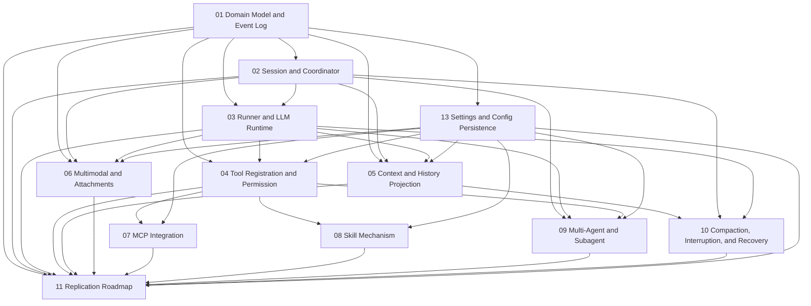

# opencode Agent Architecture Modular Replication Documentation

This set of documentation breaks down opencode's Agent system into multiple modules that can be independently developed and validated. Each document is written to be self-contained enough to start implementation right away: it first describes the module's responsibilities and boundaries, then provides the core data model, interface signatures, call chains, state machines, implementation steps, and acceptance criteria.

The original overview document remains in the parent directory, suitable for reading through at once; this directory is intended for module-by-module implementation.

## Source Code Consistency

A new audit report comparing against the current opencode source code has been added:

- [Source Code Alignment Audit Report](./12-source-alignment-audit.zh.md)

There are two types of content in these module documents: one type consists of main paths already implemented in the current V2 Session Core, such as durable prompt admission, `session.next.*` events, Location-scoped Runner, `Tool.make`/ToolRegistry, `PermissionV2`, System Context Epoch, and automatic compaction; the other type consists of extension designs recommended to be implemented incrementally during replication, such as full MCP/plugin tool materialization, manual compact route, agent switching, per-prompt tool overrides, and partial reference expansion. The audit report will annotate each item as "consistent," "needs terminology alignment," or "belongs to extension design."

## Reading Order

It is recommended to read and develop in the following order:

1. [Domain Model and Event Log](./01-domain-model-and-event-log.zh.md)
2. [Session, Prompt Admission, and Coordinator](./02-session-admission-and-coordinator.zh.md)
3. [Agent Runner and LLM Runtime](./03-agent-runner-and-llm-runtime.zh.md)
4. [Tool Registration, Tool Execution, and Permission System](./04-tool-registry-execution-and-permission.zh.md)
5. [Context Management and History Projection](./05-context-management-and-history-projection.zh.md)
6. [Multimodal Files and Chat Attachments](./06-multimodal-files-and-chat-attachments.zh.md)
7. [MCP Integration](./07-mcp-integration.zh.md)
8. [Skill Mechanism](./08-skill-system.zh.md)
9. [Multi-Agent and Subagent](./09-multi-agent-and-subagent.zh.md)
10. [Compaction, Interruption, and Recovery](./10-compaction-interrupt-and-recovery.zh.md)
11. [From-Scratch Replication Roadmap and Acceptance Checklist](./11-implementation-roadmap.zh.md)
12. [Settings, Configuration Persistence, and Activation on Import](./13-settings-config-persistence-and-activation.zh.md)

## Module Dependency Diagram

## Development Principles

Each module adheres to the same set of architectural principles:

- **Persistence before execution**: User input, tool calls, tool results, context changes, compaction results, and interrupt signals must all be written as events or to durable inboxes before triggering asynchronous execution.
- **Projection is not the source of truth**: UI, conversation history, and context windows are all views projected from event logs and state tables, not the ultimate source of truth.
- **One model request per provider turn**: The Runner is responsible for assembling requests, invoking the LLM Runtime, consuming streaming events, and persisting events; orchestration logic must not be delegated to the provider adapter.
- **Tool execution must be auditable**: Model requests only produce tool calls; before actual execution, they must go through registry resolution, parameter validation, permission evaluation, execution, and result archiving.
- **Context must be replayable**: System context, file context, Skill instructions, and MCP-exposed capabilities must all enter the Context Epoch in a computable, persistable, and comparable form.
- **Capabilities driven by model declarations**: Whether image, audio, PDF, tool calling, structured output, thought streaming, etc., are supported is not determined by hardcoding model names but by provider capabilities.

## Single Document Reading Convention

To keep each document independently developable, a small amount of foundational concepts (e.g., `sessionID`, event log, `Location`, tool call state) may be repeated within documents. This repetition is intentional: handing any single document to another developer does not require including the entire documentation set.

If the same interface name appears with slightly omitted fields, the earlier foundational module takes precedence; subsequent modules only show the fields they care about.
