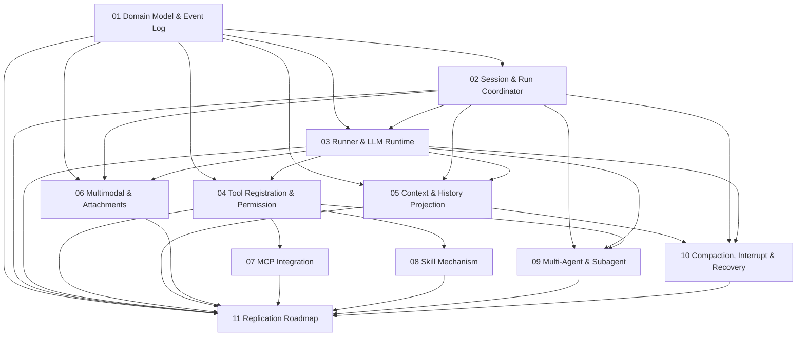

# opencode Agent Architecture Modular Replication Documentation

This set of documentation breaks down the opencode Agent system into multiple modules that can be independently developed and validated. Each document is designed to be self-contained for immediate implementation: it first explains the module's responsibilities and boundaries, then provides the core data models, interface signatures, call chains, state machines, implementation steps, and acceptance criteria.

The original overview document remains in the parent directory, suitable for a complete read-through; this directory is designed for step-by-step module implementation.

## Source Code Consistency

A new audit report comparing against the current opencode source code has been added:

- [Source Code Consistency Audit Report](./12-source-alignment-audit.zh.md)

There are two types of content in this set of module documents: one type covers the main paths already implemented in the current V2 Session Core, such as durable prompt admission, `session.next.*` events, Location-scoped Runner, `Tool.make`/ToolRegistry, `PermissionV2`, System Context Epoch, and automatic compaction; the other type covers extended designs recommended to be implemented modularly during replication, such as complete MCP/plugin tool materialization, manual compact route, agent switch, per-prompt tool overrides, and partial reference expansion. The audit report will mark each item as "consistent," "needs口径 alignment," or "belongs to extended design."

## Reading Order

It is recommended to read and develop in the following order:

1. [Domain Model and Event Log](./01-domain-model-and-event-log.zh.md)
2. [Session, Prompt Admission, and Run Coordinator](./02-session-admission-and-coordinator.zh.md)
3. [Agent Runner and LLM Runtime](./03-agent-runner-and-llm-runtime.zh.md)
4. [Tool Registration, Tool Execution, and Permission System](./04-tool-registry-execution-and-permission.zh.md)
5. [Context Management and History Projection](./05-context-management-and-history-projection.zh.md)
6. [Multimodal Files and Chat Attachments](./06-multimodal-files-and-chat-attachments.zh.md)
7. [MCP Integration](./07-mcp-integration.zh.md)
8. [Skill Mechanism](./08-skill-system.zh.md)
9. [Multi-Agent and Subagent](./09-multi-agent-and-subagent.zh.md)
10. [Compaction, Interruption, and Recovery](./10-compaction-interrupt-and-recovery.zh.md)
11. [From-Scratch Replication Roadmap and Acceptance Checklist](./11-implementation-roadmap.zh.md)

## Module Dependency Diagram

## Development Principles

Each module adheres to the same set of architectural principles:

- **Persistence before execution**: User input, tool calls, tool results, context changes, compaction results, and interrupt signals must all be written as events or to a durable inbox before triggering asynchronous execution.
- **Projection is not the source of truth**: UI, message history, and context windows are all projected views from event logs and state tables, not the ultimate source of truth.
- **One provider turn equals one model request**: The Runner is responsible for assembling requests, calling the LLM Runtime, consuming streaming events, and persisting events; orchestration logic must not be delegated to provider adapters.
- **Tool execution must be auditable**: The model request only produces tool calls; actual execution must go through registry resolution, parameter validation, permission evaluation, execution, and result archiving.
- **Context must be replayable**: System context, file context, Skill instructions, and MCP-exposed capabilities must all enter the Context Epoch in a computable, persistable, and comparable form.
- **Capabilities driven by model declarations**: Whether images, audio, PDFs, tool calls, structured output, thinking streams, etc., are supported depends on provider capabilities, not hardcoded model names.

## Single-Document Reading Convention

To make each document independently developable, a small number of basic concepts (such as `sessionID`, event logs, `Location`, and tool call status) will be repeated within documents. This repetition is intentional: copying any single document for another developer does not require attaching the entire documentation set.

If the same interface name appears with slightly omitted fields, the earlier foundational module takes precedence; subsequent modules only show the fields they care about.
