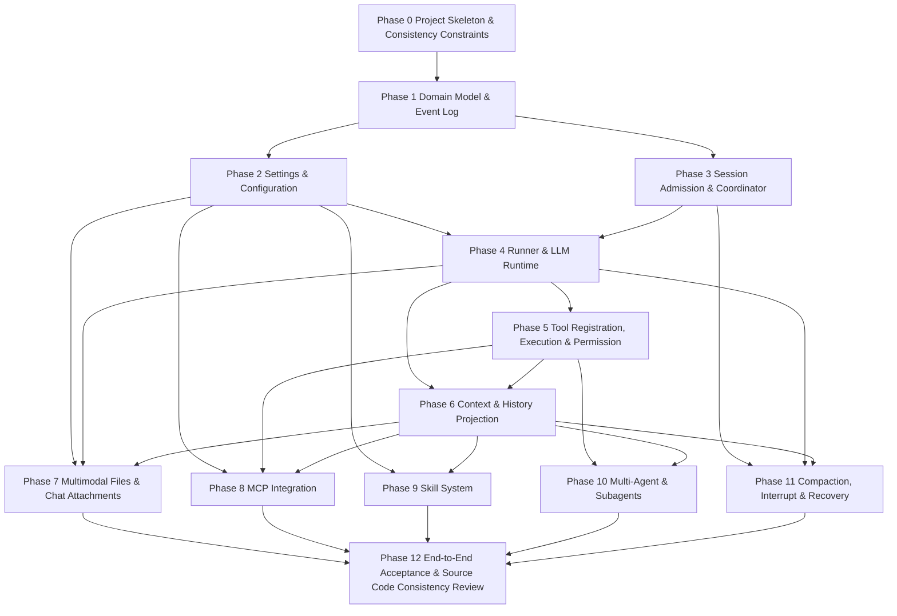

# Complete System Implementation Plan

This document organizes the previously broken-down architecture documents into an executable complete system implementation plan. Its goal is not to replace the design of each module, but to tell the development team: which design to read first, what to deliver, how to divide the work, how to accept deliverables, which interfaces must be stabilized, and ultimately to replicate an Agent system consistent with opencode's current V2 architecture.

For NextEngine, this plan should be read as a bridge from opencode's Agent architecture to the AI Agent implementation inside a Godot Engine derivative. The module boundaries and invariants come from opencode; the concrete implementation must map them onto NextEngine's editor extension points, `editor/agent_v1`, `editor/user_system`, `scene/gui` UI controls, project/workspace model, and engine-side persistence/runtime constraints.

Each section includes a "Reading Guide" pointing to the corresponding module documentation. During actual development, first read this plan to determine the boundaries of the current phase, then go to the referenced module documentation to fill in data models, function signatures, call chains, and implementation details.

## Usage

It is recommended to proceed as follows:

1. First complete "Phase 0" for the project skeleton and global constraints.
2. Gradually deliver core capabilities according to "Phases 1-11", ensuring each phase forms a runnable closed loop.
3. Run the corresponding acceptance scenarios after completing each phase, rather than piling up defects from multiple phases until the end.
4. Finally execute "Phase 12" for end-to-end acceptance and source code consistency review.

This plan defaults to using opencode V2's core constraints:

- Separation of prompt admission and model execution: user input is persisted first, then scheduled for execution.
- Only one local drain is allowed per Session at any given time.
- Each provider turn calls `llm.stream(request)` only once.
- Local tool calls must go through the materialized registry snapshot, schema codecs, tool-owned permission assertion, execution, output encoding/bounding, and settlement.
- Context must be projectable, replayable, and auditable before entering the model.
- Configuration import, permission rules, MCP, Skill, Agent, and attachments must not bypass the unified runtime pipeline.

## Overall Dependency Graph



## Phase 0: Project Skeleton & Consistency Constraints

Reading Guide:

- [README: Module Reading Order & General Principles](./README.zh.md)
- [Source Code Consistency Audit Report](./source-alignment-audit.zh.md)
- [From-Scratch Recreation Roadmap & Acceptance Checklist](./implementation-roadmap.zh.md)

Goal:

Establish a project skeleton that allows continuous iteration and write the key constraints of the V2 Session Core as tests or assertions to prevent subsequent modules from implementing incompatible loops.

Deliverables:

- Monorepo or multi-package project skeleton.
- Server core packages: hosting Session, Event, Runner, Tool, Permission, Context, Config.
- UI/API packages: hosting chat box, attachments, permission confirmation, configuration editing.
- Test infrastructure: unit tests, integration tests, fake provider, fake MCP server.
- Unified ID, time, Location, logging, error model.

Key Constraints:

```ts
type Location = {
  projectID: string
  workspaceID?: string
}

type Result<T, E> =
  | { ok: true; value: T }
  | { ok: false; error: E }
```

Implementation Steps:

1. Define package boundaries: core cannot depend on UI, provider adapter cannot take over Session loop.
2. Define test matrix: event log, Session enqueue, Runner, tool, permission, context, attachment, MCP, Skill, subagent all have separate acceptance.
3. Prepare fake provider: supports text, tool calls, errors, streaming events; all subsequent core loops will first use it for validation.
4. Prepare minimal API: create Session, submit prompt, subscribe to events, respond to permissions, read configuration.

Acceptance Criteria:

- Can start service and create empty Session.
- Can write and read minimal events.
- Fake provider can be called by tests but does not yet need to connect to full Runner.
- All phase document links are accessible from README or this plan.

## Phase 1: Domain Model & Event Log

Reading Guide:

- [01 Domain Model & Event Log](./01-domain-model-and-event-log.zh.md)
- [05 Context Management & History Projection](./05-context-management-and-history-projection.zh.md)

Goal:

Implement the system source of truth. Sessions, messages, tool calls, tool results, attachments, context snapshots, compaction summaries, and interrupts must all be persistable as events or state tables, with support for sequential replay per Session.

Deliverables:

- `SessionStore`
- `EventStore`
- `SessionInputStore`
- `AttachmentBlobStore`
- `HistoryProjection`
- Base event schema and migration mechanism

Core Data Models:

```ts
type Session = {
  id: string
  location: Location
  parentSessionID?: string
  agentName?: string
  createdAt: number
  updatedAt: number
}

type EventRow = {
  id: string
  sessionID: string
  sequence: number
  type: string
  payload: unknown
  createdAt: number
}

interface EventStore {
  append(input: {
    sessionID: string
    type: string
    payload: unknown
    idempotencyKey?: string
  }): Promise<EventRow>

  list(input: {
    sessionID: string
    afterSequence?: number
    limit?: number
  }): Promise<EventRow[]>
}
```

Call Chain:

```text
service command
  -> validate domain input
  -> append event or update durable state
  -> project read model
  -> publish event to subscribers
```

Implementation Steps:

1. First implement append-only event log, ensuring monotonically increasing sequence within the same Session.
2. Then implement projector to project events into UI messages and model-visible history.
3. Implement attachment blob storage, storing only content address, MIME, size, hash, source metadata.
4. Add version field to event schema, reserving space for future migration.

Acceptance Criteria:

- Sessions and events remain readable after restart.
- Manually writing user, assistant, tool events can be projected into messages.
- Concurrent appends to same Session produce no duplicate sequences.
- Attachment metadata and binary content can be read separately.

## Phase 2: Settings, Configuration Persistence & Activation

Reading Guide:

- [11 Settings, Configuration Persistence & Activation](./11-settings-config-persistence-and-activation.zh.md)
- [04 Tool Registration, Execution & Permission System](./04-tool-registry-execution-and-permission.zh.md)
- [07 MCP Integration](./07-mcp-integration.zh.md)
- [08 Skill Mechanism](./08-skill-system.zh.md)

Goal:

Establish configuration loading, merging, persistence, invalidation, and UI local settings system. Provider, Agent, Permission, MCP, Skill, Command, Plugin must all be imported and activated from a unified configuration entry point.

Deliverables:

- `ConfigService`
- `Config.entries()`
- `ConfigParser`
- `ConfigVariableResolver`
- `ConfigMigration`
- Server-side configuration HTTP API
- Frontend local `settings.v3` or equivalent store

Core Interface:

```ts
interface ConfigService {
  get(): Promise<AppConfig>
  entries(): Promise<ConfigEntry[]>
  update(patch: ConfigPatch): Promise<AppConfig>
  updateGlobal(patch: ConfigPatch): Promise<AppConfig>
  invalidate(reason: string): Promise<void>
}

type ConfigEntry = {
  source: "global" | "project" | "opencode" | "env" | "remote" | "account" | "managed"
  path?: string
  priority: number
  data: unknown
}
```

Call Chain:

```text
process startup
  -> discover config entries
  -> parse JSON/JSONC
  -> migrate legacy config
  -> resolve {env:} and {file:}
  -> merge by priority
  -> import provider/agent/permission/mcp/skill/plugin
  -> expose effective AppConfig
```

Implementation Steps:

1. Implement config source discovery: global, project, `.opencode`, environment variables, remote, account, managed.
2. Implement JSON/JSONC parsing, V1 migration, variable substitution, and priority merging.
3. Convert provider catalog, agent definitions, permission rules, MCP server, skill source into respective module inputs.
4. Implement `PATCH /config`: write to current instance config file and trigger instance invalidation or reload.
5. Persist frontend settings separately: theme, layout, input preferences affect only UI, not server configuration.

Acceptance Criteria:

- After modifying project configuration, new provider/agent/permission/MCP/Skill can take effect.
- `{env:NAME}` and `{file:path}` substitution behavior is testable.
- Configuration priority is stable and explainable.
- UI settings take effect immediately but do not write to server runtime config.

## Phase 3: Session Admission & Run Coordinator

Reading Guide:

- [02 Session, Prompt Admission & Run Coordination](./02-session-admission-and-coordinator.zh.md)
- [01 Domain Model & Event Log](./01-domain-model-and-event-log.zh.md)

Goal:

Implement the boundary for user input queuing and run scheduling. Submitting a prompt is only responsible for durable admission and advisory wake-up of the Session drain; actual model execution is completed by Runner within safe boundaries.

Deliverables:

- `SessionService.prompt`
- `SessionExecution.resume`
- `SessionExecution.wake`
- `SessionExecution.interrupt`
- `SessionRunCoordinator`
- Prompt exact retry handling
- Prompt delivery mode: default steer, explicit queue

Core Interface:

```ts
interface SessionService {
  prompt(input: {
    sessionID: string
    id?: string
    prompt: Prompt
    delivery?: "steer" | "queue"
    resume?: boolean
  }): Promise<PromptAdmission>
}

interface SessionExecution {
  resume(sessionID: string): Promise<void>
  wake(sessionID: string, seq?: number): Promise<void>
  interrupt(sessionID: string, seq?: number): Promise<void>
}
```

Call Chain:

```text
POST /session/:id/prompt
  -> SessionService.prompt
  -> write session_input row
  -> append session.next.prompt.admitted event
  -> if resume !== false: SessionExecution.wake(sessionID, admittedSeq)
  -> coordinator joins or schedules drain
```

Implementation Steps:

1. `prompt` does not implicitly create Session; caller must provide existing `sessionID`.
2. On exact retry with same `messageID`, reuse only when Session, prompt, delivery mode are consistent.
3. `resume: false` only enqueues without waking, for batch import or recovery scenarios.
4. Coordinator drains Sessions serially, allowing parallelism across different Sessions.
5. Interrupt only affects active drain locally owned by current process; idle or missing is no-op.

Acceptance Criteria:

- Prompt first enters durable inbox, then triggers wake.
- Multiple wakes to same Session are coalesced.
- Different Sessions can execute concurrently.
- Exact retry and conflict reuse have clear outcomes.

## Phase 4: Agent Runner & LLM Runtime

Reading Guide:

- [03 Agent Runner & LLM Runtime](./03-agent-runner-and-llm-runtime.zh.md)
- [05 Context Management & History Projection](./05-context-management-and-history-projection.zh.md)

Goal:

Implement the main loop of provider turn: promote user input from durable inbox, reconstruct history and context, resolve model and tool capabilities, call `llm.stream(request)` once, consume streaming events, and persist to disk.

Deliverables:

- `SessionRunner`
- `LLMRuntimeRegistry`
- Provider-neutral request/stream event
- Fake provider adapter
- At least one real provider adapter
- Streaming event publisher

Core Interface:

```ts
interface SessionRunner {
  run(input: {
    sessionID: string
    force?: boolean
  }): Promise<RunResult>
}

interface LLMRuntime {
  stream(request: ModelRequest): AsyncIterable<ModelStreamEvent>
}

type ModelRequest = {
  model: ModelRef
  system: string[]
  messages: ModelMessage[]
  tools: ModelTool[]
  abortSignal?: AbortSignal
}
```

Call Chain:

```text
SessionExecution drain
  -> SessionRunner.run({ sessionID })
  -> promote admitted inputs at safe boundary
  -> reload projected history
  -> build Context Epoch
  -> materialize tools
  -> resolve provider/model
  -> llm.stream(request)
  -> publish text/reasoning/tool/input deltas
  -> append durable completion or failure events
```

Implementation Steps:

1. Runner public interface remains `run({ sessionID, force? })`.
2. Provider adapter is only responsible for protocol mapping, not Session orchestration.
3. Each provider turn explicitly calls `llm.stream(request)` once.
4. Stream deltas can be pushed in real-time; durable replay relies on ended/success/failed boundary events.
5. Provider errors uniformly map to standard failure events.

Acceptance Criteria:

- Fake provider can generate plain assistant text.
- Provider errors persist as explainable failures.
- Streaming text displays in real-time, replay does not rely on live-only deltas.
- Tests can assert only one `llm.stream(request)` per provider turn.

## Phase 5: Tool Registration, Tool Execution & Permission System

Reading Guide:

- [04 Tool Registration, Tool Execution & Permission System](./04-tool-registry-execution-and-permission.zh.md)
- [11 Settings, Configuration Persistence & Activation](./11-settings-config-persistence-and-activation.zh.md)

Goal:

Implement a unified tool system. Built-in tools, MCP tools, Skill scripts, subagent task tools must all be registered as the same type of opaque tool and pass through the permission system before execution.

Deliverables:

- `Tool.make(...)`
- `ToolRegistry`
- `ToolExecutor`
- `ToolSettlement`
- `PermissionService`
- Permission pending/allow/deny/reject events
- Built-in read/write/shell class tools

Core Interface:

```ts
type AnyTool = Tool.Definition<any, any>

interface ToolRegistry {
  register(tools: Record<string, AnyTool>): Promise<RegistrationScope>

  materialize(permissions?: PermissionRuleset): Promise<MaterializedToolSet>
}

type MaterializedToolSet = {
  definitions: ModelToolDefinition[]
  settle(input: {
    sessionID: string
    agent: string
    assistantMessageID: string
    call: ToolCall
  }): Promise<ToolSettlement>
}

interface PermissionService {
  assert(input: PermissionAssertInput): Promise<void>
  reply(input: PermissionReplyInput): Promise<void>
}
```

Call Chain:

```text
model emits tool call
  -> resolve materialized tool identity
  -> validate arguments by schema
  -> evaluate PermissionV2 action/resource/effect
  -> ask UI if pending
  -> execute tool if allowed
  -> append tool result event
  -> next provider turn receives tool result
```

Implementation Steps:

1. Tool definitions are created via `Tool.make(...)`, not exposing arbitrarily constructible structures externally.
2. Registry is isolated by Location scope; omitting `workspaceID` means implicit-local.
3. Materialization captures tool identity exposed to the model in the current turn; subsequent stale calls must be rejected.
4. Permission rules use action/resource/effect, supporting once, always, reject.
5. UI is only the permission response entry point; actual permission judgment must execute on server.

Acceptance Criteria:

- Read-only tools can execute without manual confirmation.
- Write-file and shell default to permission pending.
- After user deny, model receives rejected tool result.
- Invalid tool arguments do not execute tool.
- Stale tool calls are rejected and persisted.

## Phase 6: Context Management & History Projection

Reading Guide:

- [05 Context Management & History Projection](./05-context-management-and-history-projection.zh.md)
- [01 Domain Model & Event Log](./01-domain-model-and-event-log.zh.md)
- [03 Agent Runner & LLM Runtime](./03-agent-runner-and-llm-runtime.zh.md)

Goal:

Implement context construction before model request. System prompts, Skill guidance, configured instructions, and other privileged system sources are reconciled through the Session Context Epoch; historical messages, compaction checkpoints, attachments, and materialized tool definitions are assembled by the Runner from projected history and runtime registries at the same safe boundary.

Deliverables:

- `HistoryProjection`
- `HistorySelector`
- `ContextSourceRegistry`
- `ContextEpochService`
- Token estimator
- System context algebra

Core Interface:

```ts
interface ContextEpochService {
  initialize(input: {
    sessionID: string
    location: Location
    agent: string
    context: SystemContext
  }): Promise<SessionContextEpoch | undefined>

  prepare(input: {
    sessionID: string
    location: Location
    agent: string
    context: SystemContext
  }): Promise<SessionContextEpoch>

  requestReplacement(sessionID: string, seq: number): Promise<void>
}

type SessionContextEpoch = {
  sessionID: string
  baseline: string
  snapshot: SystemContextSnapshot
  agent: string
  baselineSeq: number
  replacementSeq?: number
  revision: number
}
```

Call Chain:

```text
Runner before provider turn
  -> project durable history
  -> collect context sources
  -> initialize/prepare Session Context Epoch
  -> select history from baselineSeq and compaction boundary
  -> materialize tool names through ToolRegistry
  -> build ModelRequest
```

Implementation Steps:

1. Distinguish three views: event source of truth, UI projection, model history.
2. History trimming cannot break tool call and tool result pairs.
3. Context Epoch belongs to Session level, recording baseline, snapshot, agent, baselineSeq, revision.
4. Context Source only declares its observed domain and content hash for easy comparison and replay.
5. System context built-ins are placed in a unified registry, not scattered across Runner branches.

Acceptance Criteria:

- Session Context Epoch is initialized before the first model-visible prompt and prepared before provider turns.
- Epoch explains the privileged system baseline, source snapshot, effective agent, baselineSeq, and revision; selected history and materialized tools belong to Runner request construction, not epoch fields.
- Overlong history is trimmed, but tool pairs remain intact.
- Same event log can replay equivalent model requests.

## Phase 7: Multimodal Files & Chat Attachments

Reading Guide:

- [06 Multimodal Files & Chat Attachments](./06-multimodal-files-and-chat-attachments.zh.md)
- [03 Agent Runner & LLM Runtime](./03-agent-runner-and-llm-runtime.zh.md)
- [11 Settings, Configuration Persistence & Activation](./11-settings-config-persistence-and-activation.zh.md)

Goal:

Implement adding attachments in chat box, attachment persistence, model capability checking, and provider multimodal request mapping. Support multimodal models reading images and other files, while ensuring unsupported models have a clear rejection path.

Deliverables:

- Chat box draft attachment state
- `AttachmentResolver`
- `AttachmentBlobStore`
- `ImageNormalizer`
- `FilePreprocessor`
- `ModelPartBuilder`
- Provider multimodal mapper

Core Data Models:

```ts
type DraftAttachment = {
  id: string
  source: "paste" | "file-picker" | "drag-drop" | "path" | "tool-output"
  name: string
  mime: string
  size: number
  previewURL?: string
  status: "local" | "uploading" | "ready" | "failed"
}

type InputPart =
  | { type: "text"; text: string }
  | { type: "attachment"; attachmentID: string }

type ModelPart =
  | { type: "text"; text: string }
  | { type: "image"; mime: string; data: Uint8Array | string }
  | { type: "file"; mime: string; data: Uint8Array | string; filename?: string }
```

Call Chain:

```text
user adds attachment in chat box
  -> create DraftAttachment
  -> validate MIME/size/source
  -> store blob and metadata
  -> submit prompt with attachment part IDs
  -> Runner resolves attachment IDs
  -> check model capability
  -> normalize image or preprocess file
  -> build provider-specific model parts
  -> llm.stream(request)
```

Implementation Steps:

1. Chat box supports paste, drag-drop, file picker, path reference, but all submissions unify to `attachmentID`.
2. Server stores blob and metadata, never sends local paths directly to cloud models.
3. provider/model capability declares whether image, file, audio, PDF inputs are supported.
4. Image input undergoes format, dimension, size normalization before mapping to provider request.
5. Document-type files can first undergo text extraction or summarization, then serve as context source or file part.

Acceptance Criteria:

- Multimodal models can answer image-related questions.
- Non-multimodal models return explicit capability error when receiving images.
- Attachments remain resolvable from blob store on replay.
- Large files are rejected, truncated, or preprocessed, never directly stuffed into prompt.

## Phase 8: MCP Integration

Reading Guide:

- [07 MCP Integration](./07-mcp-integration.zh.md)
- [04 Tool Registration, Execution & Permission System](./04-tool-registry-execution-and-permission.zh.md)
- [11 Settings, Configuration Persistence & Activation](./11-settings-config-persistence-and-activation.zh.md)

Goal:

Connect tools, resources, and prompts exposed by MCP servers into the unified capability pipeline. MCP tools are ordinary tools from the model's perspective but still must go through Location-scoped registry and PermissionV2.

Deliverables:

- `MCPClientManager`
- Server lifecycle manager
- Discovery snapshot
- MCP tool adapter
- MCP resource adapter
- MCP prompt adapter
- MCP configuration import

Core Interface:

```ts
interface MCPClientManager {
  start(input: MCPServerConfig): Promise<MCPServerHandle>
  discover(input: { serverID: string }): Promise<MCPDiscoverySnapshot>
  callTool(input: MCPToolCall): Promise<MCPToolResult>
  readResource(input: MCPResourceRead): Promise<MCPResourceResult>
}
```

Call Chain:

```text
config imports MCP servers
  -> start configured server
  -> discover tools/resources/prompts
  -> convert MCP tools to Tool.make(...)
  -> register with stable namespace
  -> model calls mcp__server__tool
  -> permission check
  -> MCP callTool
  -> ordinary tool result event
```

Implementation Steps:

1. Server startup failure must not crash the entire Agent; only mark corresponding capabilities as unavailable.
2. MCP tool naming must be stable to avoid name conflicts across different servers.
3. Discovery snapshot participates in Context Epoch or tool materialization, ensuring stale calls are identifiable.
4. Resources only enter model after user selection or context source reference, never auto-injected in full.
5. Permission resource for MCP tools should include server, tool, parameter summary, and other auditable information.

Acceptance Criteria:

- Local stdio MCP server can be discovered and register tools.
- MCP tool calls go through unified permission flow.
- MCP resources can be selected to enter context.
- After MCP server disconnects, Agent can still continue normal conversation.

## Phase 9: Skill System

Reading Guide:

- [08 Skill Mechanism](./08-skill-system.zh.md)
- [05 Context Management & History Projection](./05-context-management-and-history-projection.zh.md)
- [11 Settings, Configuration Persistence & Activation](./11-settings-config-persistence-and-activation.zh.md)

Goal:

Implement a discoverable, selectable, progressively loadable Skill mechanism. Skill descriptions enter context, Skill resources are read on demand, and Skill scripts or tool execution must go through permission and tool pipelines.

Deliverables:

- `SkillDiscovery`
- `SkillRegistry`
- `SkillSelector`
- Skill context source
- Skill resource reader
- Skill script tool adapter

Core Interface:

```ts
interface SkillRegistry {
  refresh(sources: SkillSource[]): Promise<void>
  list(input: { location: Location }): Promise<SkillManifest[]>
  resolve(input: { skillName: string; location: Location }): Promise<ResolvedSkill>
}

interface SkillSelector {
  select(input: {
    prompt: string
    explicitNames: string[]
    available: SkillManifest[]
  }): Promise<SelectedSkill[]>
}
```

Call Chain:

```text
config imports skill sources
  -> discover SKILL manifests
  -> register metadata
  -> user explicitly names skill or selector matches prompt
  -> Skill Context Source contributes instructions
  -> optional resources loaded on demand
  -> optional scripts exposed through tools and permissions
```

Implementation Steps:

1. Skill discovery only reads manifest and summary, not recursively loading all resources.
2. Explicitly named Skills take priority in context; unmatched Skills are not injected into prompt.
3. Skill resources use on-demand reading, avoiding stuffing large reference materials into every turn's request.
4. Skill scripts should not execute directly; they must be wrapped as tools and go through permission system.
5. Skill sources can come from local directories, remote packages, plugins, or configuration imports.

Acceptance Criteria:

- Explicit Skills enter Context Epoch.
- Unnamed and untriggered Skills do not pollute prompt.
- Skill resources can be read on demand with source recording.
- Skill script execution triggers corresponding permission policies.

## Phase 10: Multi-Agent & Subagents

Reading Guide:

- [09 Multi-Agent & Subagent](./09-multi-agent-and-subagent.zh.md)
- [04 Tool Registration, Execution & Permission System](./04-tool-registry-execution-and-permission.zh.md)
- [02 Session, Prompt Admission & Run Coordination](./02-session-admission-and-coordinator.zh.md)

Goal:

Implement Agent configuration, Agent switching, and subagent task tool. Subagents must have child Sessions, execute via normal Session/Runner pipeline, and return results as tool results to the parent Session.

Deliverables:

- `AgentService`
- Agent config import
- `task` built-in tool
- Child Session creation and association
- Subagent permission inheritance policy
- Depth, fanout, timeout limits

Core Interface:

```ts
interface AgentService {
  list(location: Location): Promise<AgentDefinition[]>
  resolve(input: { location: Location; name?: string }): Promise<AgentDefinition>
  createChildSession(input: {
    parentSessionID: string
    agentName: string
    task: string
  }): Promise<Session>
}

type AgentDefinition = {
  name: string
  model?: ModelRef
  tools?: string[]
  permission?: PermissionPolicy
  system?: string[]
  maxDepth?: number
}
```

Call Chain:

```text
parent model calls task tool
  -> validate requested agent and depth
  -> create child Session
  -> prompt child Session with task
  -> SessionExecution.wake(childSessionID)
  -> child Runner completes
  -> summarize child result
  -> append parent tool result
```

Implementation Steps:

1. Agent definitions come from configuration but are ultimately resolved by `AgentService`.
2. `task` is an ordinary tool, thus must also go through materialization, permission judgment, and settlement.
3. Subagent permissions default to narrowing, cannot unconditionally inherit all capabilities of parent Agent.
4. Child Session records parentSessionID for audit and UI expansion.
5. maxDepth, timeout, concurrency must have hard limits.

Acceptance Criteria:

- Parent Agent can create subagent via `task` and receive results.
- Subagent event logs are separate from parent Session but have association.
- Exceeding maxDepth rejects execution.
- Subagent cannot bypass parent or system permission policies.

## Phase 11: Compaction, Interrupt & Recovery

Reading Guide:

- [10 Compaction, Interrupt & Recovery](./10-compaction-interrupt-and-recovery.zh.md)
- [05 Context Management & History Projection](./05-context-management-and-history-projection.zh.md)
- [02 Session, Prompt Admission & Run Coordination](./02-session-admission-and-coordinator.zh.md)

Goal:

Enable long-running sessions and abnormal states to run sustainably. Compaction must not delete original events; Interrupt must persist and affect active drain; after process restart, running state must be cleaned, but provider work must not be retried by default.

Deliverables:

- `CompactionService`
- Compaction summary context source
- Interrupt event and abort propagation
- Startup recovery
- Failed/running cleanup policy

Core Interface:

```ts
interface CompactionService {
  compact(input: {
    sessionID: string
    reason: "auto" | "manual"
    targetTokenBudget: number
  }): Promise<CompactionResult>
}

interface StartupRecovery {
  recover(): Promise<RecoveryReport>
}
```

Call Chain:

```text
context budget exceeded
  -> CompactionService.compact
  -> project early history
  -> summarize through model or deterministic reducer
  -> append compaction result event
  -> summary becomes Context Source
  -> later provider turns use summary plus recent history
```

Implementation Steps:

1. Automatic compaction triggered by token budget; manual compaction available as extension API.
2. Compaction summary is a new context source, not overwriting or deleting original events.
3. Interrupt writes event and aborts active provider/tool work via coordinator.
4. Startup recovery cleans process-local running markers.
5. Do not automatically retry provider work after crash unless a clear recovery strategy is designed in the future.

Acceptance Criteria:

- Long-running sessions can continue conversation after compaction is triggered.
- Original events remain fully queryable.
- After interrupt, UI can explain current state.
- No forever-running Sessions after restart.

## Phase 12: End-to-End Acceptance & Source Code Consistency Review

Reading Guide:

- [From-Scratch Recreation Roadmap & Acceptance Checklist](./implementation-roadmap.zh.md)
- [Source Code Consistency Audit Report](./source-alignment-audit.zh.md)
- All module documents referenced in previous phases of this plan

Goal:

String all modules together into a complete product path, and check whether implementation deviates from opencode's real architecture. This phase no longer adds major features, only fixes boundaries between modules, event semantics, permission loopholes, and context non-replayability issues.

End-to-End Scenarios:

```text
Plain text
  -> prompt admission
  -> Runner provider turn
  -> assistant durable result
  -> UI projection
```

```text
Tool call
  -> model emits tool call
  -> registry materialization check
  -> permission evaluate
  -> execute
  -> tool result event
  -> next provider turn
```

```text
Multimodal attachment
  -> chat draft attachment
  -> blob store
  -> capability check
  -> provider image/file part
  -> assistant answer
```

```text
MCP + Skill + Subagent
  -> config imports MCP and Skill
  -> context epoch includes selected skill
  -> MCP tool registered
  -> parent calls task
  -> child Session completes
  -> parent receives tool result
```

Consistency Checklist:

- `SessionService.prompt` only does durable admission and wake, not directly running model.
- `SessionRunner.run` entry only needs `sessionID` and optional `force`.
- Each provider turn has only one `llm.stream(request)`.
- Live delta and durable replay boundaries are clear.
- ToolRegistry is Location-scoped, materialization can identify stale calls.
- PermissionV2 executes on server, supporting once, always, reject.
- Context Epoch is Session-level baseline/snapshot/agent/baselineSeq/revision.
- Configuration import affects provider, agent, permission, MCP, Skill, but UI settings do not pollute server config.
- Multimodal attachments enter model via blob/part/capability pipeline, not sending local paths directly to provider.
- Subagents execute via child Sessions, not running a bypass loop in memory.

Final Acceptance Criteria:

- From new Session to text reply, tool calls, permission confirmation, attachments, multimodal, MCP, Skill, subagent, compaction, interrupt, recovery all work.
- Any model request can explain its history, context, tool list, and configuration source.
- Any tool execution can explain its registration source, parameters, permission decision, and result.
- After restart, readable state can be recovered without automatically retrying unconfirmed provider work.
- "Consistent" items in source code consistency audit report remain consistent; "extension design" items are explicitly marked as extension capabilities in implementation.

## Cross-Phase Work Splitting Recommendations

Work that can be done in parallel:

- UI chat box draft state can start after Phase 3, but attachment submission waits for Phase 7 blob/part model to stabilize.
- Provider adapter can be developed in parallel after fake provider is complete, but cannot bypass Phase 4 neutral request.
- MCP and Skill can be developed in parallel after Phase 5 tool registration and Phase 6 context source stabilize.
- Subagent UI display can start with read-only tree, then connect real-time state after Phase 10 child Session association is complete.
- Configuration UI can iterate independently after Phase 2 completes, but saves must go through server config API.

Work not to be done in parallel or in advance:

- Do not implement private execution path for MCP tools before tool module is complete.
- Do not concatenate Skill/MCP resources directly into prompt before Context Epoch is complete.
- Do not expose write-file, shell, remote MCP capabilities before permission module is complete.
- Do not implement "in-memory subagent" before child Session model is complete.
- Do not do aggressive compaction before events and projection are stable.

## Recommended Commit Order

1. `docs/core`: domain model, event log, Session skeleton.
2. `feat(config)`: config loading, merging, persistence, invalidation.
3. `feat(session)`: prompt admission, coordinator, interrupt skeleton.
4. `feat(runtime)`: Runner, fake provider, real provider adapter.
5. `feat(tool)`: ToolRegistry, ToolSettlement, PermissionV2.
6. `feat(context)`: HistoryProjection, Context Epoch, token budget.
7. `feat(attachment)`: chat attachments, multimodal parts, capability check.
8. `feat(mcp)`: MCP lifecycle, tool/resource/prompt adapter.
9. `feat(skill)`: Skill discovery, selection, context source.
10. `feat(agent)`: AgentService, task tool, child Session.
11. `feat(session)`: compaction, startup recovery, complete interrupt semantics.
12. `test(e2e)`: end-to-end acceptance matrix and source code consistency review.

## Minimal Recreatable System Boundary

If you need to first deliver a minimal but architecturally correct version, the scope can be reduced to:

- Text input and text output.
- Fake provider plus one real provider.
- Read-only file tool and one shell tool requiring authorization.
- Session admission, Runner, ToolRegistry, Permission, Context Epoch all retained.
- Defer MCP, Skill, subagent, multimodal, and compaction, but interface positions must not be missing.

The key for this minimal version is not feature quantity, but a correct main loop: persist input, coordinate drain, construct context, call model once, handle tools, persist results. As long as this closed loop is stable, subsequent modules can be connected as independent work packages according to this plan.
