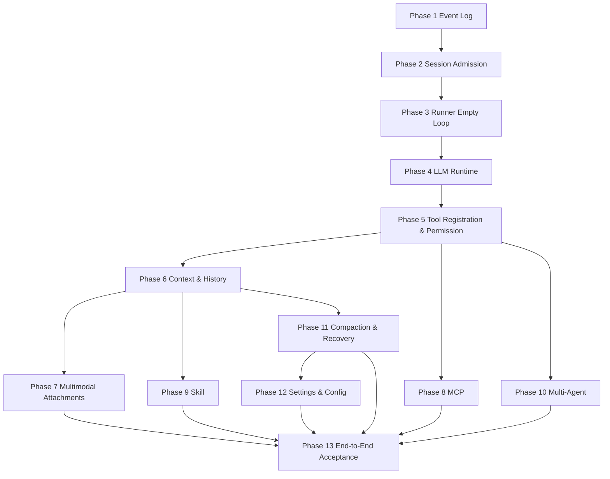

# From-Scratch Replication Roadmap and Acceptance Checklist

This roadmap connects the previous 10 modules into an executable development plan. It is recommended to submit each phase incrementally, with each phase having a self-contained minimal closed loop. Avoid implementing real models, MCP, multimodality, and sub-agents all at once from the start.

## Overall Milestones



## Phase 1: Event Log and Domain Models

Deliverables:

- `SessionStore`
- `EventStore`
- `AttachmentBlobStore`
- Basic ID generator
- `HistoryProjection.projectMessages`

Minimal interface:

```ts
interface EventStore {
  append(input: AppendEventInput): Promise<EventRow>
  list(input: ListEventInput): Promise<EventRow[]>
}
```

Acceptance:

- Manually writing user/assistant/tool events can be projected into messages.
- Events remain readable after restart.
- Sequence numbers monotonically increase within the same Session.

## Phase 2: Session Admission

Deliverables:

- `SessionService.prompt`
- `SessionInputStore`
- `prompt.admitted/promoted` events
- Precise retry conflict detection

Acceptance:

- Prompt is first stored, then woken.
- `resume = false` only stores, no execution.
- Correct retry behavior for the same messageID.

## Phase 3: Run Coordinator and Empty Runner

Deliverables:

- `SessionExecution.wake/interrupt/getState`
- Serial drain within the same Session
- Empty Runner only performs promotion, no model invocation

Acceptance:

- Multiple wakes for the same Session are merged.
- Different Sessions can run concurrently.
- Interrupt can abort the active drain.

## Phase 4: LLM Runtime

Deliverables:

- `LLMRuntimeRegistry`
- One fake provider
- One real provider adapter
- Provider-neutral stream event

Acceptance:

- A plain prompt can generate assistant text.
- Provider errors are standardized and recorded as events.
- Only one `llm.stream(request)` call per provider turn.

## Phase 5: Tool Registration, Execution, and Permission

Deliverables:

- `Tool.make(...)` opaque tool definition
- `ToolRegistry`
- `ToolSettlement`
- `PermissionService`
- Built-in read-only tool, file-write tool, shell tool

Acceptance:

- Model can call read-only tools and see results in the next round.
- File-write and shell tools trigger permission pending by default.
- User denies permission → model receives a rejection result.
- Tool execution is skipped if parameters are invalid.

## Phase 6: Context Management and History Projection

Deliverables:

- `HistorySelector`
- `ContextSourceRegistry`
- `ContextEpochService`
- Token estimator

Acceptance:

- Each provider turn has a Context Epoch.
- Epoch records system, history ids, tool names, source hashes.
- Long histories can be truncated without breaking tool pairs.

## Phase 7: Multimodal Attachments

Deliverables:

- Chatbox draft attachment state
- `AttachmentResolver`
- `ImageNormalizer`
- `ModelPartBuilder`
- Provider multimodal mapping

Acceptance:

- After pasting a screenshot, a multimodal model can read it.
- Models that don't support images explicitly reject them.
- Local paths are not directly sent as text paths to cloud models.
- Large files are rejected or go through blob/preprocessing.

## Phase 8: MCP Integration

Deliverables:

- `MCPClientManager`
- Discovery snapshot
- Conversion from MCP tool to `Tool.make(...)` tool value
- MCP resource/prompt service

Acceptance:

- MCP tools have stable namespaces.
- MCP tool execution follows unified permission rules.
- Server failure does not bring down the entire Agent.
- Resources can be selected by the user to enter the context.

## Phase 9: Skill System

Deliverables:

- `SkillDiscovery`
- `SkillRegistry`
- `SkillSelector`
- Skill Context Source

Acceptance:

- Explicit Skills can inject into Context Epoch.
- Unmatched Skills do not enter the prompt.
- Skill resources are read on demand.
- Skill script execution follows permission rules.

## Phase 10: Multi-Agent and Sub-Agents

Deliverables:

- `AgentService`
- `task` tool
- Child Session
- Sub-agent permission inheritance and depth limit

Acceptance:

- Main Agent can create child Sessions via `task`.
- Sub-agent results return to the parent Session as tool results.
- Permissions are not inherited unconditionally.
- `maxDepth` is enforced.

## Phase 11: Compaction, Interruption, and Recovery

Deliverables:

- `CompactionService`
- Compaction summary Context Source
- `StartupRecovery`
- Interruption state recorded as events

Acceptance:

- State after provider/tool interruption is explainable.
- Running state is cleaned up after restart.
- Compaction does not delete original events.
- Summary can replace early history in the context.

## Phase 12: Settings, Config Persistence, and Import Activation

Deliverables:

- `Config.entries()` priority-ordered documents/directories
- App config `get/update/updateGlobal/invalidate`
- JSON/JSONC parsing, V1 migration, variable substitution
- Provider/skill config plugins
- HTTP config API
- Frontend `settings.v3` persisted store

Acceptance:

- Global, project, `.opencode`, environment, remote, and managed configs are merged by priority.
- Provider config can change the catalog.
- Skills config can register directory/url sources.
- PATCH `/config` writes and triggers instance disposal.
- UI settings take effect locally immediately without polluting server-side config.

## Phase 13: End-to-End Acceptance

End-to-End Scenario 1: Plain Text

```text
User submits text
  -> prompt admitted/promoted
  -> Runner invokes model
  -> assistant text recorded as event
  -> UI projection displays reply
```

End-to-End Scenario 2: Tool Call

```text
User asks to read a file
  -> Model calls read_file
  -> ToolRegistry resolve
  -> Permission allow
  -> Tool result recorded as event
  -> Runner passes tool result to model in next round
  -> Model summarizes
```

End-to-End Scenario 3: Permission

```text
User asks to execute a command
  -> Model calls shell
  -> Permission ask
  -> UI displays request
  -> User denies
  -> tool failed denied
  -> Model receives rejection and adjusts response
```

End-to-End Scenario 4: Multimodal

```text
User pastes an image and asks a question
  -> Attachment resolver saves blob
  -> Capability check
  -> Image part enters ModelRequest
  -> Model answers question about the image
```

End-to-End Scenario 5: MCP

```text
Start MCP server
  -> Discover tools
  -> Register mcp__server__tool
  -> Model calls MCP tool
  -> Permission ask/allow
  -> Result returned as normal tool result
```

End-to-End Scenario 6: Sub-agent

```text
Main Agent calls task
  -> Child Session created
  -> Child Runner completes task
  -> Result returned to parent Session
  -> Parent Agent continues reasoning
```

## Minimal Core Interface Overview

```ts
interface CoreServices {
  sessionStore: SessionStore
  eventStore: EventStore
  sessionInputStore: SessionInputStore
  sessionService: SessionService
  sessionExecution: SessionExecution
  runner: SessionRunner
  llm: LLMRuntime
  toolRegistry: ToolRegistry
  toolSettlement: ToolSettlement
  permissionService: PermissionService
  projection: HistoryProjection
  historySelector: HistorySelector
  contextEpoch: ContextEpochService
  attachmentResolver: AttachmentResolver
  agentService: AgentService
  mcp?: MCPClientManager
  skills?: SkillRegistry
  compaction?: CompactionService
}
```

## Key Invariants

- User input must first be admitted, then woken.
- Prompt admitted ≠ visible to model; only promoted is visible.
- Only one active drain at a time per Session.
- Only one `llm.stream(request)` call per provider turn.
- Tool calls must go through registry resolve, schema validate, permission assert, execute, event append.
- Permission decisions are made server-side, not UI-only.
- Context Epoch must be persisted before the provider turn.
- Multimodal attachments must undergo capability checks; local paths must not be sent directly to cloud models.
- MCP and Skills both go through unified registration/context/permission pipelines.
- Sub-agents must have child Sessions, not silently run in memory.
- Compaction does not delete original events.
- Do not automatically retry provider work after a crash unless there is a clear recovery design.

## Recommended Test Matrix

| Module | Unit Tests | Integration Tests |
| --- | --- | --- |
| EventStore | sequence/idempotency | Projection after restart |
| Session | exact retry/promotion | Merging multiple wakes |
| Runner | stream event consume | Tool loop |
| Runtime | provider mapping | Fake provider E2E |
| Tool | schema validation | Permission allow/deny |
| Permission | rule matching | UI response |
| Context | token budget | Epoch replay |
| Attachment | MIME/size/path | Image input E2E |
| MCP | name mapping | MCP tool call |
| Skill | trigger selection | Guidance in epoch |
| Subagent | depth limit | Task result |
| Recovery | cleanup rules | Crash simulation |

## Development Breakdown Suggestions

- First get the fake provider working, then integrate the real model.
- Implement read-only tools first, then write tools and shell.
- Implement ask/deny/allow once first, then persistent session/workspace authorization.
- Support images first, then PDFs, audio, and tool media.
- Start with local MCP stdio, then remote HTTP.
- Start with one sub-agent executing sequentially, then concurrency and depth strategies.
