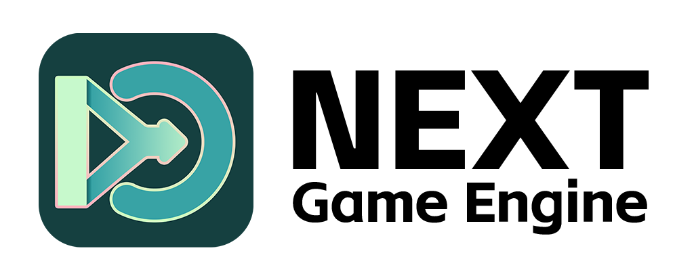

# NEXT Engine

English | [简体中文](README.zh-CN.md)

NEXT Engine is a fork of Godot Engine that brings AI-assisted development directly into the editor. It keeps the familiar scene tree, script, resource, and debugging workflow, while adding an AI runtime that can understand project context, edit content, manage tasks, and keep changes reviewable.

<p align="center">
  
</p>

## Overview

NEXT Engine focuses on an editor-native AI workflow for Godot-style game and interactive project development.

- Upstream project and base engine: Godot Engine 4.x.
- Current NEXT version format: `0.0.4.7.1-preview`, combining NEXT's own version with the Godot base version.
- Current engine metadata: `NEXT Engine 4.7.1 rc`, with docs branch `4.7` in `version.py`.
- Key dependencies: Godot Engine, `cmark 0.31.1` in `thirdparty/cmark/`, and Alibaba PuHuiTi in `thirdparty/fonts/AlibabaPuHuiTi_3_65_Medium.woff2`.
- License: MIT, following Godot Engine's license model. Third-party components remain under their own licenses.

The largest NEXT-specific changes are in the AI Agent runtime, editor AI UI, user system, Markdown parsing/rendering stack, update checking, release automation, project documentation, and related tests.

## Features

- AI Dock for chat, model selection, attachments, progress, token usage, todos, permission prompts, and diff review.
- Agent V1 backend with durable sessions, event logs, projections, runner coordination, provider-neutral model requests, tool settlement, interruption, recovery, and compaction.
- Built-in project/editor tools for reading and searching files, editing scenes, writing scripts, editing shaders, managing todos, and collecting structured requirements.
- Unified permission flow for local tools, MCP tools, Skill-driven workflows, and subagents.
- MCP integration for configured servers, tools, resources, prompts, startup permissions, and namespaced tool materialization.
- Skill system for discovering, selecting, injecting, and reading specialized workflow guidance on demand.
- User system under `editor/user_system/` for authentication, server-backed profile data, local session handling, and UI integration.
- Runtime Markdown stack: `core/markdown` wraps cmark into `MarkdownParser` and `MarkdownNode`; `scene/gui/MarkdownViewer` renders Markdown as a self-drawn `Control`.
- NEXT update checking from GitHub Releases, surfaced in the AI settings About page.
- GitHub Actions release automation for `v*` tags, with standardized release asset names for Android, iOS, macOS, Windows, and Web builds.

## Project Status

NEXT Engine is under active development. The first preview release line is `v0.0.4.7.1-preview`, and the current focus areas are:

- Making AI Dock interactions smoother and more predictable.
- Hardening Agent V1 session recovery, permission handling, tool settlement, and context management.
- Improving scene, script, Shader, and project-file editing through reviewable tools.
- Continuing the migration from editor-only Markdown components toward the runtime `MarkdownViewer`.
- Keeping user-system authentication and server configuration separate from local runtime state.
- Stabilizing CI, release assets, version comparison, and in-editor update checks.

Public architecture references:

- `editor/agent_v1/core/API.md`
- `editor/agent_v1/domain/API.md`
- `editor/agent_v1/best_practices.md`

## Releases

Branch pushes run CI builds and checks. Release publishing is reserved for version tags that start with `v`, for example `v0.0.4.7.1-preview`.

Tag-triggered releases collect the successful build artifacts, repackage them with standard names such as `NextEngine-v0.0.4.7.1-preview-windows-editor-x86_64.zip`, and upload them to GitHub Releases. The default release workflow currently publishes Android, iOS, macOS, Windows, and Web assets; Linux builds are not part of the main CI/release workflow.

## Build from Source

Daily build:

```powershell
scons platform=windows
```

Development and test build:

```powershell
scons platform=windows target=editor dev_build=yes tests=yes
```

Agent V1 tests:

```powershell
bin\next.windows.editor.dev.x86_64.console.exe --test --test-case="*[AgentV1]*"
```

MarkdownViewer tests:

```powershell
bin\next.windows.editor.dev.x86_64.console.exe --test --test-case="*[MarkdownViewer]*"
```

User system tests:

```powershell
bin\next.windows.editor.dev.x86_64.console.exe --test --test-case="*[UserSystem]*"
```

Version/update tests:

```powershell
bin\next.windows.editor.dev.x86_64.console.exe --test --test-case="*[Version]*"
bin\next.windows.editor.dev.x86_64.console.exe --test --test-case="*[Editor][AgentV1]*NEXT update*"
```

## Project Layout

```text
editor/
  agent_v1/       Agent V1 backend, domain model, runtime, tools, permissions, MCP, Skills, agents, UI adapter
  agent_ui/       AI Dock, Composer, message list, settings pages, review panels, About/update UI
  user_system/    User authentication, profile/session handling, server integration

core/
  markdown/       MarkdownParser and MarkdownNode core parsing layer backed by cmark
  next_version.*  NEXT version parsing and comparison helpers

scene/gui/
  markdown_viewer*  Runtime MarkdownViewer node and document/layout/draw/image/highlighting helpers

thirdparty/
  cmark/          cmark 0.31.1 CommonMark parser sources
  fonts/          Bundled fonts, including AlibabaPuHuiTi_3_65_Medium.woff2

tests/
  core/           Version, file access, and core regression tests
  editor/         Agent V1, AI UI, update-check, and user-system tests
  scene/          MarkdownViewer runtime scene tests
```

## Contributing

- Read `AGENTS.md` before making changes in this repository.
- Before implementing a feature, check the related code for reusable infrastructure, domain models, services, and tests.
- Prefer the existing Agent V1 contracts in `core`, `domain`, `session`, `tools`, and `permission` instead of adding parallel systems.
- Prefer `core/markdown` and `MarkdownViewer` for Markdown work instead of adding another parser or RichTextLabel renderer.
- Keep editor UI as a projection of backend state; durable state should live in the Agent/session/event/config layers.
- Add or update focused tests when changing runtime behavior, user flows, release/version handling, or reusable infrastructure.
- Keep local design notes outside Git under ignored paths such as `.devdocs/`; public, code-facing contracts should live next to the implementation.
- Run `prek` on changed files before submitting C/C++, workflow, or text-format changes.

## License

NEXT Engine follows the MIT license inherited from Godot Engine. See `LICENSE.txt`.

The NEXT Engine name, logo, icon, app icon, splash image, and other brand assets are not licensed for unrestricted use under MIT. See `TRADEMARKS.md`.

This repository also bundles third-party components such as cmark and fonts. Their copyright and license terms remain with their respective upstream projects or bundled license files.
